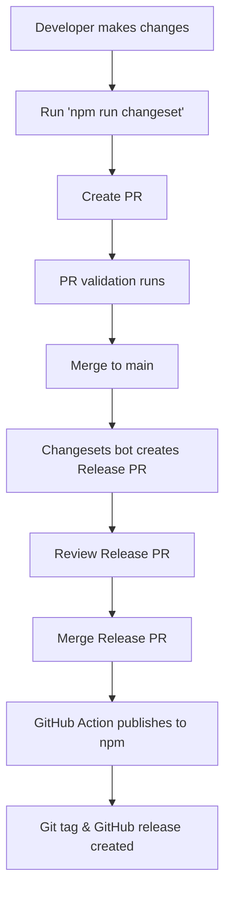
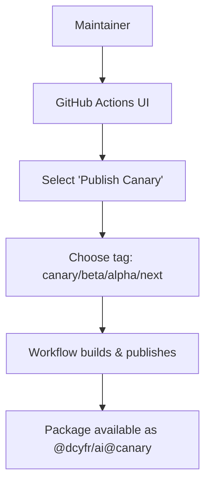

# Automated Release Management Setup - Complete

## Summary

Automated incremental updates and release management has been configured for `@dcyfr/ai` to npm using Changesets and GitHub Actions.

## What Was Installed

### Dependencies

```json
{
  "devDependencies": {
    "@changesets/cli": "^2.27.10",
    "@changesets/changelog-github": "^0.5.0"
  }
}
```

### Configuration Files

1. **`.changeset/config.json`** - Changesets configuration
   - Public access
   - GitHub changelog integration
   - Main branch releases

2. **GitHub Actions Workflows:**
   - `.github/workflows/release.yml` - Automated publishing on merge to main
   - `.github/workflows/publish-canary.yml` - Manual canary/pre-release publishing
   - `.github/workflows/validate-pr.yml` - PR validation with changeset check

3. **Scripts:**
   - `scripts/update-changelog.mjs` - Automated changelog generator

4. **Documentation:**
   - `docs/RELEASE_MANAGEMENT.md` - Comprehensive release guide (300+ lines)
   - `docs/RELEASE_QUICK_START.md` - Quick reference guide
   - `.github/ISSUE_TEMPLATE/release-checklist.md` - Release checklist template
   - `.github/PULL_REQUEST_TEMPLATE.md` - PR template with changeset reminder

## Features Enabled

### 1. Automated Version Management
- Semantic versioning (major.minor.patch)
- Changeset-based version bumps
- Automatic CHANGELOG.md generation
- Git tag creation

### 2. Automated Publishing
- Publish to npm on Release PR merge
- npm provenance for supply chain security
- Automatic GitHub releases
- Parallel canary/pre-release support

### 3. Quality Gates
- Pre-publish validation (tests, build, typecheck, lint)
- PR validation workflows
- Changeset detection (with warning)

### 4. Multiple Release Channels
- **Stable** - Main production releases
- **Canary** - Pre-release testing
- **Beta** - Beta channel
- **Alpha** - Early alpha
- **Next** - Next major version preview

## Workflow Overview

### Standard Release Flow



### Canary Release Flow



## Scripts Added

```json
{
  "scripts": {
    "changeset": "changeset",
    "changeset:version": "changeset version",
    "changeset:publish": "changeset publish",
    "release": "changeset publish",
    "version:patch": "npm version patch -m 'chore: bump version to %s'",
    "version:minor": "npm version minor -m 'chore: bump version to %s'",
    "version:major": "npm version major -m 'chore: bump version to %s'"
  }
}
```

## Required GitHub Secrets

To enable automated publishing, add these secrets to your GitHub repository:

1. **NPM_TOKEN** - Required for publishing to npm
   - Go to https://www.npmjs.com/settings/~/tokens
   - Create new **Automation** token
   - Add to GitHub repo secrets

2. **GITHUB_TOKEN** - Auto-provided by GitHub Actions

### Adding Secrets

```bash
# In GitHub repository:
Settings → Secrets and variables → Actions → New repository secret

Name: NPM_TOKEN
Value: npm_xxxxxxxxxxxxxxxxxxxxxxxxxxxxxxxxxx
```

## How to Use

### For Contributors

1. **Make changes**
2. **Add changeset:**
   ```bash
   npm run changeset
   ```
3. **Select type:** patch/minor/major
4. **Write summary**
5. **Commit and push**

### For Maintainers

1. **Review PRs with changesets**
2. **Merge to main**
3. **Changesets bot creates Release PR**
4. **Review Release PR** (check version & CHANGELOG)
5. **Merge Release PR** → Automatic publish to npm

### Canary Releases

```bash
# Via GitHub UI:
Actions → Publish Canary → Run workflow → Select tag
```

## Testing the Setup

### 1. Create a Test Changeset

```bash
cd /Users/drew/DCYFR/code/dcyfr-ai
npm run changeset
```

Choose:
- Change type: `patch`
- Summary: `Test automated release setup`

This creates `.changeset/some-random-name.md`

### 2. Commit the Changeset

```bash
git add .changeset/*.md
git commit -m "chore: test changeset for automated release"
git push origin main
```

### 3. Watch for Release PR

Within a few minutes, the Changesets bot should:
1. Detect the changeset
2. Create a "Release PR" titled "chore: release package"
3. Update package.json version to 1.0.3
4. Update CHANGELOG.md with your changeset

### 4. Test Publish (Optional)

**Before merging the Release PR:**
- Review the version bump (1.0.2 → 1.0.3)
- Review CHANGELOG.md updates
- Ensure NPM_TOKEN secret is configured

**When ready:**
- Merge the Release PR
- GitHub Action will automatically publish to npm

## Verification Checklist

- [x] Changesets installed and configured
- [x] GitHub Actions workflows created
- [x] Scripts added to package.json
- [x] Documentation created
- [x] PR template updated
- [x] Release checklist template created
- [ ] NPM_TOKEN secret configured (manual step required)
- [ ] Test changeset created and validated

## Next Steps

1. **Configure NPM_TOKEN Secret:**
   ```
   GitHub → Settings → Secrets → New repository secret
   Name: NPM_TOKEN
   Value: [your npm automation token]
   ```

2. **Test the Workflow:**
   ```bash
   npm run changeset
   # Follow prompts
   git add .changeset/*.md
   git commit -m "test: validate automated release"
   git push
   ```

3. **Monitor Release PR Creation:**
   - Check GitHub Actions for workflow runs
   - Watch for Release PR from changesets bot

4. **Optional: Test Canary Release:**
   - Go to Actions tab
   - Select "Publish Canary" workflow
   - Click "Run workflow"
   - Select tag: `canary`
   - Verify publish succeeds

## Documentation Links

- **Full Guide:** [docs/RELEASE_MANAGEMENT.md](docs/RELEASE_MANAGEMENT.md)
- **Quick Start:** [docs/RELEASE_QUICK_START.md](docs/RELEASE_QUICK_START.md)
- **Changesets Docs:** https://github.com/changesets/changesets
- **npm Package:** https://www.npmjs.com/package/@dcyfr/ai

## Troubleshooting

### Release PR Not Created

**Check:**
1. Changesets exist: `ls .changeset/*.md`
2. GitHub Actions logs for errors
3. Workflow has proper permissions

### Publish Failed

**Common issues:**
1. Missing or invalid NPM_TOKEN
2. Version already exists on npm
3. Build or test failures

**Solution:**
```bash
# Check workflow logs in Actions tab
# Verify NPM_TOKEN is valid
# Test build locally: npm run build && npm test
```

### npm ci Error (Missing package-lock.json)

**Issue:** `npm ci` requires package-lock.json

**Solution (Already Fixed):**
The workflows now automatically fall back to `npm install` if `package-lock.json` doesn't exist:

```yaml
- name: Install Dependencies
  run: |
    if [ -f package-lock.json ]; then
      npm ci
    else
      npm install
    fi
```

If you want reproducible builds, commit a package-lock.json:
```bash
npm install --package-lock-only
git add package-lock.json
git commit -m "chore: add package-lock.json for reproducible builds"
```

### Changeset Not Detected

**Solution:**
```bash
npm run changeset
git add .changeset/*.md
git commit -m "chore: add changeset"
```

## Benefits

✅ **Automated versioning** - No manual version bumps
✅ **Automatic changelogs** - Generated from changesets
✅ **Quality gates** - Tests run before publish
✅ **Supply chain security** - npm provenance enabled
✅ **Multiple release channels** - Stable, canary, beta, alpha
✅ **Git tag automation** - Tags created automatically
✅ **GitHub releases** - Automated release notes
✅ **Rollback safety** - Immutable versions on npm

## Version History

- **v1.0.2** - Current version
- **v1.0.1** - Previous release
- **v1.0.0** - Initial public release

## Support

**Issues:** https://github.com/dcyfr/dcyfr-ai/issues
**Discussions:** https://github.com/dcyfr/dcyfr-ai/discussions
**npm:** https://www.npmjs.com/package/@dcyfr/ai

---

**Setup Date:** February 1, 2026
**Status:** ✅ Complete (NPM_TOKEN configuration pending)
**Next Release:** v1.0.3 (when test changeset merged)
