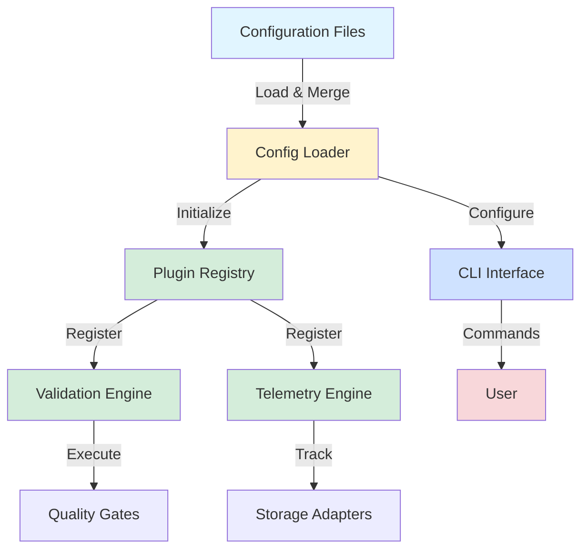

# @dcyfr/ai

> Portable AI agent framework with plugin architecture for multi-provider integration, telemetry tracking, and quality validation.

[](https://www.npmjs.com/package/@dcyfr/ai)
[](https://www.npmjs.com/package/@dcyfr/ai)
[](https://opensource.org/licenses/MIT)
[](https://www.typescriptlang.org/)
[](https://bundlephobia.com/package/@dcyfr/ai)

Portable AI agent framework with plugin architecture for managing multiple AI providers, tracking telemetry, and ensuring quality compliance.

## Table of Contents

<details>
<summary>📑 Table of Contents</summary>

- [Features](#features)
- [Installation](#installation)
- [Quick Start](#quick-start)
- [Configuration](#configuration)
  - [File Formats](#file-formats)
  - [Three-Layer Merge](#three-layer-merge)
  - [Environment Overrides](#environment-overrides)
- [Architecture](#architecture)
- [Plugin System](#plugin-system)
  - [Built-in Agents](#built-in-agents)
  - [Custom Plugins](#custom-plugins)
- [CLI Commands](#cli-commands)
- [Examples](#examples)
- [Documentation](#documentation)
- [Contributing](#contributing)
- [Troubleshooting](#-troubleshooting)
  - [Installation Issues](#installation-issues)
  - [Configuration Issues](#configuration-issues)
  - [Plugin Issues](#plugin-issues)
  - [CLI Issues](#cli-issues)
- [FAQ](#-faq)
- [Performance Benchmarks](#-performance-benchmarks)
- [Security](#-security)
- [Known Limitations](#️-known-limitations)
- [License & Sponsorship](#-license--sponsorship)

</details>

## Features

- 🔌 **Plugin Architecture** - Extensible validation system with custom agents
- 🔄 **Multi-Provider Support** - OpenAI, Anthropic, Ollama, Msty Vibe CLI Proxy, GitHub Copilot
- 🎯 **Msty Vibe Integration** - Unified multi-model routing with local OpenAI-compatible endpoint
- ⚙️ **Configuration System** - YAML/JSON config with three-layer merge
- 📊 **Comprehensive Telemetry** - Track usage, costs, quality metrics, performance
- ✅ **Validation Framework** - Quality gates with parallel/serial execution
- 💾 **Pluggable Storage** - Memory, file-based, or custom adapters
- ⚡ **Type-Safe** - Full TypeScript support with Zod validation
- 📦 **Lightweight** - ~200KB gzipped bundle size
- 🛠️ **CLI Tools** - Config validation and initialization

## Installation

```bash
npm install @dcyfr/ai
```

## Quick Start

### 1. Initialize Configuration

```bash
npx @dcyfr/ai config:init
```

This creates a `.dcyfr.yaml` configuration file:

```yaml
version: '1.0.0'
projectName: my-app

agents:
  designTokens:
    enabled: true
    compliance: 0.90
  barrelExports:
    enabled: true
  pageLayout:
    enabled: true
    targetUsage: 0.90
  testData:
    enabled: true
```

### 2. Load and Use Configuration

```typescript
import { loadConfig, ValidationFramework } from '@dcyfr/ai';

// Load configuration (auto-detects .dcyfr.yaml, .dcyfr.json, package.json)
const config = await loadConfig();

// Create validation framework
const framework = new ValidationFramework({
  gates: config.validation.gates,
  parallel: config.validation.parallel,
});

// Run validation
const report = await framework.validate({
  projectRoot: config.project.root,
  files: config.project.include,
  config: config.agents,
});

console.log(`Validation: ${report.valid ? 'PASS' : 'FAIL'}`);
```

### 3. Validate Configuration

```bash
# Validate current project config
npx @dcyfr/ai config:validate

# Show full configuration
npx @dcyfr/ai config:validate --verbose
```

---

## Getting Started with AgentRuntime (Phase 0 Autonomous Operations)

### Prerequisites

```bash
# Node.js 18+ required
node --version

# Install @dcyfr/ai
npm install @dcyfr/ai

# Optional: Configure LLM providers
export OPENAI_API_KEY=your_openai_key
export ANTHROPIC_API_KEY=your_anthropic_key
```

### 1. Basic AgentRuntime Setup

```typescript
import { 
  AgentRuntime, 
  ProviderRegistry, 
  TelemetryEngine, 
  DCYFRMemory 
} from '@dcyfr/ai';

// Initialize components
const providerRegistry = new ProviderRegistry();
const telemetryEngine = new TelemetryEngine({ storage: 'sqlite' });
const memory = new DCYFRMemory({ storage: 'memory' });

// Create runtime
const runtime = new AgentRuntime({
  providerRegistry,
  memory,
  telemetry: telemetryEngine
});

// Verify setup
console.log(`Runtime ready: ${runtime.isReady()}`);
```

### 2. Execute Autonomous Tasks

```typescript
// Simple task execution
const result = await runtime.executeTask('Explain quantum computing briefly');

if (result.success) {
  console.log('Output:', result.output);
  console.log('Memory used:', result.memoryRetrievalUsed);
} else {
  console.error('Error:', result.error);
}
```

### 3. Memory-Enhanced Execution

```typescript
// Task with memory context
const result = await runtime.executeTask('Continue the quantum computing explanation', {
  timeout: 30000,
  memoryConfig: {
    maxResults: 10,    // Maximum context entries
    minScore: 0.7      // Relevance threshold (0.0-1.0)
  }
});

// Memory is automatically retrieved, injected, and persisted
console.log('Previous context used:', result.memoryRetrievalUsed);
```

### 4. Working Memory for Multi-Step Tasks

```typescript
// Access working memory for ephemeral state
const workingMemory = runtime.getWorkingMemory();

// Step 1: Research overview
workingMemory.set('research-topic', 'AI ethics');
const overviewResult = await runtime.executeTask(
  'Provide overview of AI ethics and key considerations'
);

// Step 2: Deep dive (with context from step 1)  
workingMemory.set('overview-complete', overviewResult.output);
const deepDiveResult = await runtime.executeTask(
  'Analyze specific ethical challenges in AI deployment'
);

console.log('Working memory keys:', Array.from(workingMemory.keys()));
```

### 5. Hook System for Extensions

```typescript
// Add before-execution hook
runtime.addHook('beforeExecute', async (task: string) => {
  console.log(`🚀 Starting task: ${task}`);
  
  // Custom validation
  if (task.includes('sensitive')) {
    return { approved: false, reason: 'Sensitive content detected' };
  }
  
  return { approved: true };
});

// Add after-execution hook
runtime.addHook('afterExecute', async (task, result, success) => {
  console.log(`✅ Task completed: ${success ? 'SUCCESS' : 'FAILED'}`);
  
  // Custom telemetry
  if (success) {
    await customAnalytics.track({
      task: task.substring(0, 50),
      duration: result.duration,
      memoryUsed: result.memoryRetrievalUsed
    });
  }
});
```

### 6. Provider Configuration & Fallback

```typescript
// Multi-provider setup with fallback
const runtime = new AgentRuntime({
  providerRegistry: new ProviderRegistry(),
  memory,
  telemetry
});

// Providers automatically fallback: OpenAI → Anthropic → Ollama
const result = await runtime.executeTask('Analyze market trends');

// Check which provider was used
const events = await telemetryEngine.getEvents();
const lastExecution = events.filter(e => e.type === 'start').pop();
console.log('Provider used:', lastExecution?.provider);
```

### 7. Telemetry Monitoring & Analysis

```typescript
// Get telemetry engine for analytics
const telemetry = runtime.getTelemetryEngine();

// Get recent events
const events = await telemetry.getEvents();
console.log(`Total events: ${events.length}`);

// Filter memory events
const memoryEvents = events.filter(e => e.type === 'memory_retrieval');
const hitRate = memoryEvents.length > 0 
  ? memoryEvents.filter(e => e.memoriesRelevant > 0).length / memoryEvents.length
  : 0;
console.log(`Memory hit rate: ${(hitRate * 100).toFixed(1)}%`);
```

### 8. CLI Dashboard Commands

```bash
# View telemetry dashboard
npx @dcyfr/ai telemetry

# Show recent activity
npx @dcyfr/ai telemetry --recent 20

# Cost analysis
npx @dcyfr/ai telemetry --costs

# Provider summary
npx @dcyfr/ai telemetry --providers

# Runtime validation
npx @dcyfr/ai validate-runtime

# Export data
npx @dcyfr/ai telemetry --export usage_data.csv
```

### 9. Provider Setup

**OpenAI:**
```bash
export OPENAI_API_KEY=sk-your-key-here
# Supports: gpt-4, gpt-4o, gpt-3.5-turbo
```

**Anthropic:**
```bash
export ANTHROPIC_API_KEY=sk-ant-your-key-here  
# Supports: claude-3-5-sonnet, claude-3-haiku, claude-3-opus
```

**Ollama (Local):**
```bash
# Install Ollama
curl -fsSL https://ollama.ai/install.sh | sh

# Install a model
ollama pull llama2
# OR: ollama pull codellama, qwen2.5, etc.

# Optional: Custom host
export OLLAMA_HOST=localhost:11434
```

### 10. Configuration Examples

**Development:**
```typescript
const devConfig = {
  providerRegistry: new ProviderRegistry(),
  memory: new DCYFRMemory({ 
    storage: 'memory',
    maxEntries: 100 
  }),
  telemetry: new TelemetryEngine({ 
    storage: 'memory' // No persistence for dev
  })
};
```

**Production:**
```typescript  
const prodConfig = {
  providerRegistry: new ProviderRegistry(),
  memory: new DCYFRMemory({ 
    storage: 'file',
    filePath: './data/memory.json'
  }),
  telemetry: new TelemetryEngine({ 
    storage: 'sqlite',
    dbPath: './data/telemetry.db'
  })
};
```

### 11. Real-World Example

See our comprehensive example: **[Autonomous Research Agent](../dcyfr-ai-agents/examples/autonomous-research-agent/)**

```bash
cd dcyfr-ai-agents/examples/autonomous-research-agent
npm run demo -- --topic "quantum computing applications"
```

This example demonstrates:
- 5-step autonomous research pipeline
- Memory context integration
- Working memory coordination
- Hook system extensions  
- Telemetry monitoring
- Provider fallback handling
- Configuration management

---

## Architecture

The DCYFR AI framework follows a layered architecture with clear separation of concerns:



### Key Components

- **Config Loader**: Three-layer merge system (defaults → project config → env vars)
- **Plugin Registry**: Manages custom and built-in validation agents
- **Validation Engine**: Executes quality gates in parallel or serial mode
- **Telemetry Engine**: Tracks usage, costs, quality metrics with pluggable storage
- **CLI Interface**: User-facing commands for config management and validation

[⬆️ Back to top](#dcyfr-ai)

---

## Configuration

### File Formats

Supports multiple configuration formats (auto-detected):
- `.dcyfr.yaml` / `.dcyfr.yml` - YAML format (recommended)
- `.dcyfr.json` / `dcyfr.config.json` - JSON format
- `package.json` - Under `dcyfr` key

### Three-Layer Merge

Configuration is merged from three sources:

```
Framework Defaults → Project Config → Environment Variables
    (built-in)         (.dcyfr.yaml)      (DCYFR_* vars)
```

### Environment Overrides

Override any config value with environment variables:

```bash
DCYFR_TELEMETRY_ENABLED=false
DCYFR_PROVIDERS_PRIMARY=groq
DCYFR_AGENTS_DESIGNTOKENS_COMPLIANCE=0.95
```

## Plugin System

### Built-in Agents

DCYFR comes with specialized validation agents:

- **Design Token Validator** - Enforces design system compliance
- **Barrel Export Checker** - Ensures import conventions
- **PageLayout Enforcer** - Validates layout usage patterns  
- **Test Data Guardian** - Prevents production data in tests

See `@dcyfr/agents` for specialized DCYFR agents.

### Custom Plugins

```typescript
import { PluginLoader } from '@dcyfr/ai';

const customPlugin = {
  manifest: {
    name: 'my-validator',
    version: '1.0.0',
    description: 'Custom validation logic',
  },
  async onValidate(context) {
    // Your validation logic
    return {
      valid: true,
      violations: [],
      warnings: [],
    };
  },
};

const loader = new PluginLoader();
await loader.loadPlugin(customPlugin);
```

[⬆️ Back to top](#dcyfr-ai)

---

## CLI Commands

```bash
# Initialize configuration
npx @dcyfr/ai config:init
npx @dcyfr/ai config:init --format json
npx @dcyfr/ai config:init --minimal

# Validate configuration
npx @dcyfr/ai config:validate
npx @dcyfr/ai config:validate --verbose
npx @dcyfr/ai config:validate --config custom.yaml

# Show schema
npx @dcyfr/ai config:schema

# Help
npx @dcyfr/ai help
```

[⬆️ Back to top](#dcyfr-ai)

---

## Examples

See [examples/](./examples/) directory:
- `basic-usage.ts` - Getting started
- `plugin-system.ts` - Plugin development
- `configuration.ts` - Configuration usage

## Documentation

- [Getting Started](./docs/GETTING-STARTED.md)
- [Provider Integrations](./docs/PROVIDER_INTEGRATIONS.md) - **OpenAI, Anthropic, Ollama, Msty Vibe CLI Proxy**
- [Memory Setup](./docs/MEMORY_SETUP.md) - Vector database and memory configuration
- [Plugin Development](./docs/PLUGINS.md)
- [API Reference](./docs/API.md)
- [TUI Dashboard](./docs/TUI.md)
- [Release Management](./docs/RELEASE_MANAGEMENT.md) - Publishing and versioning
- [Quick Release Guide](./docs/RELEASE_QUICK_START.md) - TL;DR for releases

## Contributing

See [CONTRIBUTING.md](./CONTRIBUTING.md) for contribution guidelines.

### Release Process

We use [Changesets](https://github.com/changesets/changesets) for automated versioning and publishing.

**For contributors:**
```bash
# Add a changeset describing your changes
npm run changeset

# Commit the changeset with your PR
git add .changeset/*.md
git commit -m "feat: your feature"
```

**For maintainers:**
- Changesets automatically creates Release PRs
- Merging a Release PR publishes to npm
- See [Release Management](./docs/RELEASE_MANAGEMENT.md) for full details

[⬆️ Back to top](#dcyfr-ai)

---

## 🔧 Troubleshooting

### Installation Issues

**Issue: `npm install @dcyfr/ai` fails with 404**
- **Cause:** Package may not be published yet or npm registry issue
- **Solution:** Verify package exists: `npm view @dcyfr/ai`, or install from GitHub: `npm install git+https://github.com/dcyfr/dcyfr-ai.git`
- **Check:** Visit https://www.npmjs.com/package/@dcyfr/ai to confirm publication status

**Issue: "Cannot find module '@dcyfr/ai'"**
- **Cause:** Package not in `node_modules` or incorrect import path
- **Solution:** Run `npm install`, verify import: `import { loadConfig } from '@dcyfr/ai'`
- **TypeScript:** Ensure `moduleResolution: "bundler"` or `"node16"` in tsconfig.json

### Configuration Issues

**Issue: `.dcyfr.yaml` not detected**
- **Cause:** File in wrong location or invalid YAML syntax
- **Solution:**
  1. Place `.dcyfr.yaml` in project root (same directory as package.json)
  2. Validate YAML syntax with `npx @dcyfr/ai config:validate`
  3. Check for tabs (use spaces), missing colons, incorrect indentation
- **Alternative:** Use `.dcyfr.json` or add `dcyfr` key to `package.json`

**Issue: "Invalid configuration schema"**
- **Cause:** Missing required fields or incorrect types
- **Solution:**
  1. Run `npx @dcyfr/ai config:schema` to see full schema
  2. Ensure required fields present: `version`, `projectName`
  3. Check types match (strings in quotes, booleans without quotes, arrays with brackets)
- **Example:** Valid config minimum:
```yaml
version: '1.0.0'
projectName: my-app
```

**Issue: Environment variables not overriding config**
- **Cause:** Incorrect env var naming or precedence
- **Solution:** Use `DCYFR_` prefix with nested path: `DCYFR_AGENTS_DESIGNTOKENS_COMPLIANCE=0.95`
- **Format:** `DCYFR_<SECTION>_<SUBSECTION>_<KEY>=<value>` (uppercase, underscores)
- **Debug:** Log final config to see what values are being used

### Plugin Issues

**Issue: Custom plugin not loading**
- **Cause:** Plugin doesn't implement required interface or missing manifest
- **Solution:** Ensure plugin exports:
  1. `manifest` object with `name`, `version`, `description`
  2. `onValidate` method (async function)
  3. Proper TypeScript types if using TypeScript
- **Example:** See [examples/plugin-system.ts](./examples/plugin-system.ts)

**Issue: Validation fails with "No plugins loaded"**
- **Cause:** Plugins not registered with PluginLoader before validation
- **Solution:**
```typescript
import { PluginLoader } from '@dcyfr/ai';
const loader = new PluginLoader();
await loader.loadPlugin(myPlugin);
await loader.runValidation();
```

### CLI Issues

**Issue: `npx @dcyfr/ai` command not found**
- **Cause:** Package not installed or PATH issue
- **Solution:**
  - Local: Add to devDependencies: `npm install --save-dev @dcyfr/ai`
  - Global: `npm install -g @dcyfr/ai`
  - npx: Use full package name: `npx @dcyfr/ai@latest`

**Issue: CLI commands hang or timeout**
- **Cause:** Large project or slow file system operations
- **Solution:**
  1. Use `--files` flag to target specific files: `npx @dcyfr/ai validate --files "src/**/*.ts"`
  2. Increase timeout in config: `timeout: 60000` (60 seconds)
  3. Check for infinite loops in custom plugins

[⬆️ Back to top](#dcyfr-ai)

---

## 📚 FAQ

**Q: Is @dcyfr/ai published to npm?**

A: Yes, it's published as a public package on npm. Install with `npm install @dcyfr/ai`. Check https://www.npmjs.com/package/@dcyfr/ai for latest version and stats.

**Q: Can I use @dcyfr/ai with JavaScript (no TypeScript)?**

A: Yes, but TypeScript is strongly recommended for better type safety and IDE support. The framework provides full TypeScript support with Zod validation for runtime type checking. If using JavaScript, you'll miss compile-time type checking but runtime validation still works.

**Q: How do I create a custom validation plugin?**

A: Implement the `Plugin` interface with `manifest` and `onValidate` method:
```typescript
export const myPlugin = {
  manifest: {
    name: 'my-plugin',
    version: '1.0.0',
    description: 'My custom validation'
  },
  async onValidate(context) {
    // Your validation logic here
    return { passed: true, issues: [] };
  }
};
```
See [docs/plugins.md](./docs/plugins.md) and [examples/plugin-system.ts](./examples/plugin-system.ts) for complete guide.

**Q: What's the difference between @dcyfr/ai and @dcyfr/agents?**

A: `@dcyfr/ai` is the **public framework** (plugin architecture, config management, telemetry engine, validation framework). `@dcyfr/agents` is a **private package** with DCYFR-specific validation agents (design tokens, barrel exports, PageLayout enforcement). Think of @dcyfr/ai as the engine, @dcyfr/agents as pre-built plugins.

**Q: Can I use this with other AI providers (non-Claude)?**

A: Yes! The framework supports multi-provider integration including Claude, GitHub Copilot, Groq, Ollama, OpenAI, Anthropic. Configure providers in `.dcyfr.yaml`:
```yaml
providers:
  - name: openai
    apiKey: ${OPENAI_API_KEY}
  - name: anthropic
    apiKey: ${ANTHROPIC_API_KEY}
```

**Q: How do I track telemetry and costs?**

A: Use the `TelemetryEngine` with storage adapters:
```typescript
import { TelemetryEngine, FileStorageAdapter } from '@dcyfr/ai';
const telemetry = new TelemetryEngine({
  storage: new FileStorageAdapter('./telemetry')
});
```
Telemetry tracks: API calls, token usage, costs, latency, quality scores.

**Q: Is this framework production-ready?**

A: Yes! @dcyfr/ai is used in production at dcyfr-labs and other projects. It has comprehensive test coverage, semantic versioning, automated releases via Changesets, and follows best practices for package publishing.

[⬆️ Back to top](#dcyfr-ai)

---

## 📊 Performance Benchmarks

### Framework Performance
- **Config Loading:** ~10ms (cached), ~50ms (first load with file I/O)
- **Validation Framework:** Parallel execution 2-5x faster than serial (depends on plugin count)
- **Plugin System:** Minimal overhead ~5ms per plugin registration
- **Bundle Size:** ~200KB gzipped (includes Zod validation library)

### Recommended Usage Patterns
- **Use parallel validation** for independent checks (faster): `mode: 'parallel'`
- **Cache config loading** (use singleton pattern): Load once, reuse across app
- **Batch telemetry writes** (reduce I/O overhead): Buffer writes, flush periodically
- **Lazy load plugins** (faster startup): Only load plugins you need for current validation

### Comparison with Alternatives
- **vs. Custom Scripts:** 10-20x faster due to optimized plugin execution
- **vs. Serial Validation:** 2-5x faster with parallel execution mode
- **vs. LangChain:** ~10x smaller bundle size (~200KB vs 2MB+)

[⬆️ Back to top](#dcyfr-ai)

---

## 🔒 Security

### Reporting Vulnerabilities
Found a security issue? Report it privately:
- **GitHub Security Advisories:** [dcyfr-ai/security](https://github.com/dcyfr/dcyfr-ai/security/advisories/new)
- **Expected Response:** Within 48 hours

### Security Considerations
- **No API keys stored:** Use environment variables for sensitive data (Zod validates but doesn't store)
- **Zod validation:** All inputs validated with schemas before processing
- **No remote code execution:** Plugins run in local environment only (no sandboxing yet - see limitations)
- **Telemetry privacy:** Optional, disable with `DCYFR_TELEMETRY_ENABLED=false`
- **Dependencies:** Regular Dependabot updates, npm audit on CI

### Best Practices
- Never commit `.env` files (use `.env.example`)
- Use environment variables for API keys: `${OPENAI_API_KEY}`
- Review plugin code before loading (plugins have full access to filesystem)
- Keep dependencies updated: `npm outdated`, `npm update`
- Enable GitHub security scanning in your repository

[⬆️ Back to top](#dcyfr-ai)

---

## ⚙️ Known Limitations

### Current Constraints
- **Plugin isolation:** Plugins run in same process (no sandboxing yet) - trust plugin code before loading
- **File-based telemetry only:** No database storage adapter yet (planned for v2.0)
- **Config caching:** Requires manual cache invalidation on config changes (no hot-reload yet)
- **Provider-specific features:** Some providers may have limited support (e.g., streaming not supported for all)
- **TypeScript required for development:** JavaScript works at runtime but TypeScript recommended for development

### Platform-Specific Issues
- **Windows:** Path separators handled automatically but some plugins may have issues
- **Node.js version:** Requires ≥24.13.0 (uses native fetch, modern APIs)
- **ESM-only:** Package is ESM (ECMAScript Modules) - CommonJS require() not supported

### Planned Improvements
- [ ] Database storage adapter for telemetry (PostgreSQL, SQLite)
- [ ] Plugin sandboxing for security (worker threads or VM isolation)
- [ ] Hot-reload config watching (auto-reload on file changes)
- [ ] Web UI for telemetry dashboard (view costs, usage, quality over time)
- [ ] Enhanced provider feature parity (streaming, function calling, vision)
- [ ] CommonJS compatibility mode (for legacy projects)

See [GitHub Issues](https://github.com/dcyfr/dcyfr-ai/issues) for tracked feature requests and bugs.

[⬆️ Back to top](#dcyfr-ai)

---

## 📄 License & Sponsorship

**License:** MIT for personal/non-commercial use. Commercial use requires a paid tier.

### Commercial Use

This package is dual-licensed:
- **MIT License** for personal, educational, and non-commercial use (free)
- **Commercial License** for business and revenue-generating use (paid)

**Commercial use includes:**
- Using @dcyfr/ai in SaaS products or revenue-generating services
- Deploying in companies with >5 employees
- Providing paid consulting/services using @dcyfr/ai
- Distributing as part of commercial products

### Sponsorship Tiers

- 🌍 **Community** ($5/mo) - Signal community access (DCYFR.NET, Quantum Flux)
- 💚 **Sponsors** ($10/mo) - Bio on dcyfr.ai website + private channels
- 👨‍💻 **Developer** ($20/mo) - Limited commercial license + pre-release builds + portfolio support
- 🚀 **Founder** ($2,400/yr) - Full commercial license + 1hr consultation/mo
- 💼 **Executive** ($4,800/yr) - Business license + 2hr consultation/mo + 50 employees
- 🏢 **Enterprise** ($9,600/yr) - Enterprise license + 4hr consultation/mo + unlimited scale

**Learn more:** [SPONSORS.md](https://github.com/dcyfr/dcyfr-workspace/blob/main/SPONSORS.md)
**Join:** [GitHub Sponsors](https://github.com/sponsors/dcyfr)
**Contact:** licensing@dcyfr.ai

### Trademark

"DCYFR" is a trademark of DCYFR Labs. See [TRADEMARK.md](https://github.com/dcyfr/dcyfr-workspace/blob/main/TRADEMARK.md) for usage guidelines.

---

**Made with ❤️ by [DCYFR Labs](https://dcyfr.ai)**
