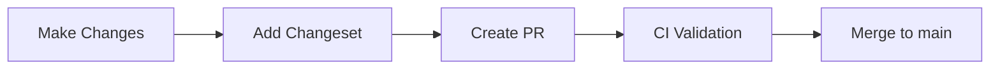
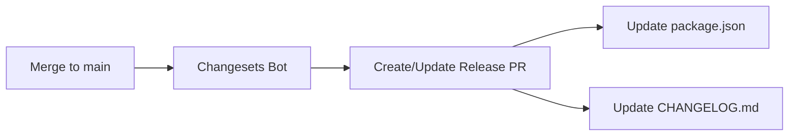
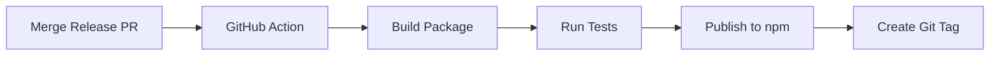

<!-- TLP:CLEAR -->
# Release Management Guide

This document describes the automated release process for `@dcyfr/ai` to npm.

## Overview

We use [Changesets](https://github.com/changesets/changesets) for automated versioning, changelog generation, and publishing to npm.

## Release Types

### 1. Standard Release (Main Branch)

**Automated via GitHub Actions when changes are merged to `main`**

**Process:**
1. Create a changeset for your changes
2. Merge PR to `main`
3. Changesets bot creates a "Release PR"
4. Merge the Release PR
5. Package is automatically published to npm

### 2. Canary Release (Pre-release Testing)

**Manual trigger for testing versions**

```bash
# Trigger via GitHub Actions UI:
# Actions → Publish Canary → Run workflow
```

**Tags available:**
- `canary` - General pre-release testing
- `beta` - Beta testing
- `alpha` - Early alpha testing
- `next` - Next major version preview

**Install canary version:**
```bash
npm install @dcyfr/ai@canary
npm install @dcyfr/ai@beta
```

## Developer Workflow

### Adding a Changeset

When you make changes that should be included in the next release:

```bash
# Run the changeset CLI
npm run changeset

# OR
npx changeset
```

**Follow the prompts:**

1. **Select change type:**
   - `patch` - Bug fixes, small updates (1.0.0 → 1.0.1)
   - `minor` - New features, backward compatible (1.0.0 → 1.1.0)
   - `major` - Breaking changes (1.0.0 → 2.0.0)

2. **Write a summary:**
   ```
   Add support for custom telemetry adapters
   ```

3. **Commit the changeset:**
   ```bash
   git add .changeset/*.md
   git commit -m "chore: add changeset for telemetry adapters"
   ```

### Changeset Examples

**Bug Fix (patch):**
```markdown
---
"@dcyfr/ai": patch
---

Fix provider fallback timeout handling
```

**New Feature (minor):**
```markdown
---
"@dcyfr/ai": minor
---

Add support for streaming responses from providers
```

**Breaking Change (major):**
```markdown
---
"@dcyfr/ai": major
---

BREAKING: Remove deprecated config.legacy option
Migrate to config.modern pattern instead
```

## Automated Release Flow

### 1. PR with Changes



**CI Checks:**
- ✓ TypeScript type checking
- ✓ ESLint validation
- ✓ Build succeeds
- ✓ All tests pass
- ⚠️ Changeset recommended (warning if missing)

### 2. Release PR Creation



**The Release PR includes:**
- Updated `package.json` version
- Updated `CHANGELOG.md` with all changes
- Links to relevant PRs/commits

### 3. Publishing to npm



**Publish includes:**
- npm provenance for supply chain security
- Automatic git tag creation
- GitHub release creation

## Manual Version Bumps

For quick patches without changesets:

```bash
# Patch version (1.0.0 → 1.0.1)
npm run version:patch

# Minor version (1.0.0 → 1.1.0)
npm run version:minor

# Major version (1.0.0 → 2.0.0)
npm run version:major
```

⚠️ **Warning:** Manual bumps skip changeset automation. Use for emergency hotfixes only.

## Scripts Reference

| Script | Description |
|--------|-------------|
| `npm run changeset` | Create a new changeset |
| `npm run changeset:version` | Consume changesets and update version |
| `npm run changeset:publish` | Publish to npm |
| `npm run release` | Alias for changeset:publish |
| `npm run version:patch` | Manual patch version bump |
| `npm run version:minor` | Manual minor version bump |
| `npm run version:major` | Manual major version bump |

## GitHub Actions Workflows

### release.yml

**Trigger:** Push to `main` branch

**Actions:**
1. Check for pending changesets
2. Create/update Release PR if changesets exist
3. Publish to npm when Release PR is merged

### publish-canary.yml

**Trigger:** Manual dispatch

**Actions:**
1. Build package
2. Create canary version (e.g., `1.0.2-canary.20260201120000`)
3. Publish with custom tag

### validate-pr.yml

**Trigger:** Pull request to `main`

**Actions:**
1. Run type checking
2. Run linting
3. Run tests
4. Build package
5. Check for changeset (warning only)

## Configuration

### .changeset/config.json

```json
{
  "changelog": ["@changesets/changelog-github", { "repo": "dcyfr/dcyfr-ai" }],
  "access": "public",
  "baseBranch": "main"
}
```

**Key settings:**
- `changelog` - Uses GitHub changelog generator with PR links
- `access` - Public package on npm
- `baseBranch` - Release from `main` branch

### package.json

```json
{
  "publishConfig": {
    "access": "public"
  }
}
```

## Prerequisites

### GitHub Secrets

Required secrets in repository settings:

| Secret | Description | How to Get |
|--------|-------------|------------|
| `NPM_TOKEN` | npm authentication token | https://www.npmjs.com/settings/~/tokens |
| `GITHUB_TOKEN` | Automatic GitHub token | Auto-provided by GitHub Actions |

**Creating NPM_TOKEN:**

1. Log in to npmjs.com
2. Go to Access Tokens → Generate New Token
3. Select **Automation** type
4. Copy token and add to GitHub Secrets

### npm Account Setup

1. **Organization access:**
   ```bash
   npm whoami
   # Should show your npm username
   
   npm org ls dcyfr
   # Should show you're a member
   ```

2. **Package access:**
   ```bash
   npm access ls-packages dcyfr
   # Should show @dcyfr/ai with write access
   ```

## Troubleshooting

### Changeset Not Detected

**Issue:** "No changeset found" warning in PR

**Solution:**
```bash
npm run changeset
# Follow prompts, commit the .changeset/*.md file
```

### Release PR Not Created

**Issue:** Changes merged but no Release PR appears

**Solutions:**
1. Check if changesets exist: `ls .changeset/*.md`
2. Check GitHub Actions logs for errors
3. Manually trigger: `npm run changeset:version`

### Publish Failed

**Issue:** Publish to npm failed in GitHub Actions

**Common causes:**
1. **Invalid NPM_TOKEN:** Regenerate token in npm settings
2. **Version already exists:** Check npm for existing version
3. **Build failed:** Check build logs in Actions

**Manual publish (emergency):**
```bash
npm run build
npm publish --access public
```

### Canary Release Not Working

**Issue:** Manual canary workflow fails

**Solutions:**
1. Check workflow permissions in `.github/workflows/publish-canary.yml`
2. Verify NPM_TOKEN secret exists
3. Check Node.js version compatibility

## Best Practices

### 1. Always Add Changesets

Add a changeset for any PR that affects users:
- ✅ New features
- ✅ Bug fixes
- ✅ API changes
- ✅ Dependency updates that affect behavior
- ❌ Internal refactoring (no user impact)
- ❌ Documentation-only changes
- ❌ Test-only changes

### 2. Write Clear Changeset Messages

**Good:**
```markdown
Add streaming support for LLM responses
Fix memory leak in provider connection pool
```

**Bad:**
```markdown
Update code
Fix bug
```

### 3. Group Related Changes

If a PR has multiple changes, add ONE changeset with all items:

```markdown
---
"@dcyfr/ai": minor
---

- Add OpenAI provider support
- Add streaming interface for all providers
- Update provider documentation
```

### 4. Test Before Release

Use canary releases to test changes:

```bash
# 1. Create canary from Actions UI
# 2. Test in separate project
npm install @dcyfr/ai@canary

# 3. If successful, merge Release PR
```

## Version Strategy

### Semantic Versioning

We follow [SemVer](https://semver.org/):

**MAJOR.MINOR.PATCH**

- **MAJOR (x.0.0)** - Breaking changes
- **MINOR (0.x.0)** - New features (backward compatible)
- **PATCH (0.0.x)** - Bug fixes

### Examples

| Change | Version | Example |
|--------|---------|---------|
| Add new provider | minor | 1.0.0 → 1.1.0 |
| Fix bug in validation | patch | 1.0.0 → 1.0.1 |
| Remove deprecated API | major | 1.0.0 → 2.0.0 |
| Update dependencies | patch | 1.0.0 → 1.0.1 |

## Release Checklist

Before merging Release PR:

- [ ] All CI checks passing
- [ ] CHANGELOG.md looks correct
- [ ] Version number is appropriate (patch/minor/major)
- [ ] No unintended changes in diff
- [ ] Tests pass locally: `npm test`
- [ ] Build succeeds: `npm run build`

After publishing:

- [ ] Verify package on npm: https://www.npmjs.com/package/@dcyfr/ai
- [ ] Test installation: `npm install @dcyfr/ai@latest`
- [ ] Check GitHub release created
- [ ] Update dependent projects if needed

## Support

**Issues:** https://github.com/dcyfr/dcyfr-ai/issues
**Discussions:** https://github.com/dcyfr/dcyfr-ai/discussions

---

**Last Updated:** February 1, 2026
**Version:** 1.0.2
