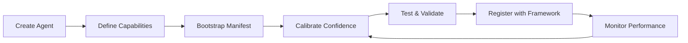

<!-- TLP:GREEN - Limited Distribution -->
# Agent Capability Development Guide

**Information Classification:** TLP:GREEN (Limited Distribution)  
**Audience:** DCYFR Agent Developers  
**Last Updated:** February 15, 2026  
**Version:** 1.0.0

---

## Table of Contents

1. [Overview](#overview)
2. [Capability Manifest Schema](#capability-manifest-schema)
3. [Creating Capability Manifests](#creating-capability-manifests)
4. [Confidence Calibration](#confidence-calibration)
5. [Verification Setup](#verification-setup)
6. [Best Practices](#best-practices)
7. [Testing Capabilities](#testing-capabilities)
8. [Integration with Delegation Framework](#integration-with-delegation-framework)
9. [Advanced Patterns](#advanced-patterns)
10. [Troubleshooting](#troubleshooting)

---

## Overview

This guide explains how to develop and maintain agent capability manifests for the DCYFR delegation framework. Agent capabilities define what an agent can do, how well it can do it, and under what conditions.

### Why Capability Manifests Matter

Capability manifests enable the delegation framework to:

- **Match agents to tasks** based on specific skills and expertise
- **Estimate success probability** using confidence scores
- **Allocate resources effectively** based on resource requirements
- **Enforce security** through TLP clearance levels
- **Track performance** by comparing actual results to declared capabilities

### Development Workflow



---

## Capability Manifest Schema

### Complete Schema Reference

```typescript
interface AgentCapabilityManifest {
  // Agent identification
  agentName: string;              // Must match agent definition name
  version: string;                // Semantic version (e.g., "1.2.3")
  
  // Capabilities array
  capabilities: AgentCapability[];
  
  // Security and compliance
  tlpClearance: TLPLevel;         // "CLEAR" | "GREEN" | "AMBER" | "RED"
  
  // Calibration metadata
  lastCalibrated: string;         // ISO 8601 timestamp
  calibrationMethod: string;      // How confidence was determined
  calibrationSampleSize?: number; // Number of tasks used for calibration
  
  // Optional metadata
  description?: string;           // Human-readable agent description
  tags?: string[];               // Searchable tags
  tier?: string;                 // "workspace" | "proprietary" | "public"
}

interface AgentCapability {
  // Capability identification
  name: string;                   // Unique capability identifier
  category: CapabilityCategory;   // Standardized category
  
  // Description
  description: string;            // Human-readable description
  
  // Performance metrics
  confidence: number;             // 0-100: Agent's confidence level
  
  // Resource requirements
  resources: ResourceProfile;     // CPU, memory, time requirements
  
  // Prerequisites
  prerequisites?: string[];       // Required tools, permissions, context
  
  // Examples
  examples?: string[];            // Example tasks this capability handles
  
  // Version tracking
  since?: string;                 // Version when capability was added
  deprecated?: boolean;           // Whether capability is deprecated
}

interface ResourceProfile {
  estimatedCpu?: number;          // 0-1: CPU utilization estimate
  estimatedMemory?: string;       // e.g., "256MB", "1GB"
  estimatedTime?: string;         // e.g., "5m", "1h", "2h"
  scalability?: "low" | "medium" | "high"; // How well it scales
}

type CapabilityCategory =
  | "code_generation"
  | "code_review"
  | "testing"
  | "security_analysis"
  | "architecture_design"
  | "documentation"
  | "debugging"
  | "performance_optimization"
  | "data_analysis"
  | "deployment"
  | "monitoring"
  | "refactoring"
  | "research"
  | "consultation"
  | "project_management"
  | "general";

type TLPLevel = "CLEAR" | "GREEN" | "AMBER" | "RED";
```

### Example Manifest

```json
{
  "agentName": "security-engineer",
  "version": "1.0.0",
  "capabilities": [
    {
      "name": "security_analysis",
      "category": "security_analysis",
      "description": "Comprehensive security analysis including vulnerability scanning, threat modeling, and compliance checking",
      "confidence": 85,
      "resources": {
        "estimatedCpu": 0.6,
        "estimatedMemory": "512MB",
        "estimatedTime": "30m",
        "scalability": "medium"
      },
      "prerequisites": [
        "read access to codebase",
        "security scanning tools available"
      ],
      "examples": [
        "OWASP Top 10 vulnerability assessment",
        "Authentication system security audit",
        "API security review"
      ],
      "since": "1.0.0"
    },
    {
      "name": "threat_modeling",
      "category": "security_analysis",
      "description": "Identify potential security threats and attack vectors in system architecture",
      "confidence": 80,
      "resources": {
        "estimatedCpu": 0.4,
        "estimatedMemory": "256MB",
        "estimatedTime": "45m",
        "scalability": "low"
      },
      "examples": [
        "Create threat model for microservices architecture",
        "Identity authentication flow attack vectors",
        "Data flow security analysis"
      ]
    }
  ],
  "tlpClearance": "AMBER",
  "lastCalibrated": "2026-02-15T10:00:00Z",
  "calibrationMethod": "peer_comparison",
  "calibrationSampleSize": 50,
  "description": "Security specialist focusing on OWASP compliance and threat modeling",
  "tags": ["security", "owasp", "threat-modeling", "vulnerability-scanning"],
  "tier": "workspace"
}
```

---

## Creating Capability Manifests

### Method 1: Automated Bootstrap (Recommended)

The fastest way to create a capability manifest is using the bootstrap script:

```bash
# Bootstrap a single agent
cd dcyfr-ai/packages/ai
node scripts/bootstrap-agent-capabilities.mjs \
  --agent /path/to/agent.agent.md \
  --output manifests/capabilities/

# Bootstrap all agents in a directory
node scripts/bootstrap-agent-capabilities.mjs \
  --agents-dir /path/to/agents/ \
  --output manifests/capabilities/
```

**What the bootstrap script does:**

1. **Parses agent frontmatter** - Extracts name, description, tools, model, category
2. **Infers capabilities** - Maps category and tools to capability categories
3. **Estimates confidence** - Provides initial confidence scores based on category
4. **Determines TLP clearance** - Infers from agent tier (proprietary → RED, workspace → GREEN)
5. **Sets resource profiles** - Estimates CPU, memory, time based on capability complexity
6. **Generates manifest** - Creates properly formatted JSON manifest

### Method 2: Manual Creation

For fine-grained control, create manifests manually:

```typescript
// 1. Import required types
import type { 
  AgentCapabilityManifest, 
  AgentCapability 
} from '@dcyfr/ai/types/agent-capabilities';

// 2. Define capabilities
const capabilities: AgentCapability[] = [
  {
    name: "typescript_refactoring",
    category: "refactoring",
    description: "Refactor TypeScript code for improved maintainability and performance",
    confidence: 82,
    resources: {
      estimatedCpu: 0.5,
      estimatedMemory: "384MB",
      estimatedTime: "20m",
      scalability: "high"
    },
    prerequisites: [
      "TypeScript compiler access",
      "Write permissions to source files"
    ],
    examples: [
      "Extract functions to reduce complexity",
      "Convert callbacks to async/await",
      "Optimize type definitions for better inference"
    ],
    since: "1.0.0"
  }
];

// 3. Create manifest
const manifest: AgentCapabilityManifest = {
  agentName: "typescript-pro",
  version: "1.0.0",
  capabilities: capabilities,
  tlpClearance: "GREEN",
  lastCalibrated: new Date().toISOString(),
  calibrationMethod: "initial_estimate",
  description: "TypeScript expert specializing in code quality and performance",
  tags: ["typescript", "refactoring", "code-quality"],
  tier: "workspace"
};

// 4. Save to file
import { writeFileSync } from 'fs';
writeFileSync(
  'manifests/capabilities/typescript-pro.json',
  JSON.stringify(manifest, null, 2)
);
```

### Method 3: Capability Bootstrap API

Use the programmatic API for custom workflows:

```typescript
import { bootstrapCapabilityManifest } from '@dcyfr/ai/delegation/capability-bootstrap';
import { readFileSync, writeFileSync } from 'fs';

// Read agent definition
const agentDefinition = readFileSync('.ai/agents/my-agent.agent.md', 'utf-8');

// Bootstrap manifest
const manifest = await bootstrapCapabilityManifest(agentDefinition, {
  agentName: 'my-agent',
  outputPath: 'manifests/capabilities/',
  calibrationOptions: {
    method: 'peer_comparison',
    peerAgents: ['similar-agent-1', 'similar-agent-2'],
    minimumSampleSize: 20
  }
});

// Customize before saving
manifest.capabilities[0].confidence = 85; // Adjust confidence
manifest.tags = ['custom', 'specialized'];

// Save customized manifest
writeFileSync(
  'manifests/capabilities/my-agent.json',
  JSON.stringify(manifest, null, 2)
);
```

---

## Confidence Calibration

Confidence scores are critical for accurate agent selection. Here's how to calibrate them effectively:

### Initial Confidence Estimation

When creating a new capability, start with conservative estimates:

| Experience Level | Initial Confidence | Guidance |
|-----------------|-------------------|----------|
| **Expert** | 80-90 | Agent has proven track record, extensive testing |
| **Proficient** | 70-80 | Agent handles most cases well, some edge cases |
| **Competent** | 60-70 | Agent handles common cases, struggles with complexity |
| **Novice** | 50-60 | Agent has basic capability, needs supervision |
| **Experimental** | 40-50 | Capability under development, frequent failures expected |

### Calibration Methods

#### 1. Peer Comparison (Recommended)

Compare your agent's performance to similar agents:

```typescript
import { CapabilityRegistry } from '@dcyfr/ai/delegation/capability-registry';

const registry = new CapabilityRegistry();
await registry.loadManifests('./manifests/capabilities/');

// Find peer agents with similar capabilities
const peers = await registry.matchAgents({
  capability: "code_review",
  minimumConfidence: 70
});

// Get peer confidence statistics
const peerConfidences = peers.map(p => 
  p.capabilities.find(c => c.name === "code_review")?.confidence || 0
);

const avgPeerConfidence = peerConfidences.reduce((a, b) => a + b, 0) / peerConfidences.length;
const myInitialConfidence = avgPeerConfidence * 0.9; // Start 10% lower as new agent

console.log(`Peers average: ${avgPeerConfidence}, My initial: ${myInitialConfidence}`);
```

#### 2. Historical Performance Analysis

Use past task performance to calibrate:

```typescript
import { ReputationEngine } from '@dcyfr/ai/reputation/reputation-engine';

const reputationEngine = new ReputationEngine();

// Get recent performance data
const performance = await reputationEngine.getAgentPerformance('my-agent', {
  capability: 'code_review',
  taskCount: 50, // Last 50 tasks
  timeRange: '30d' // Last 30 days
});

// Calculate calibrated confidence
const successRate = performance.successfulTasks / performance.totalTasks;
const avgQuality = performance.averageQualityScore;
const calibratedConfidence = Math.round((successRate * 0.6 + avgQuality * 0.4) * 100);

console.log(`Calibrated confidence: ${calibratedConfidence}%`);
```

#### 3. Test-Based Calibration

Run benchmark tasks to measure actual performance:

```typescript
// Define benchmark tasks
const benchmarkTasks = [
  {
    type: "code_review",
    difficulty: "easy",
    expectedSuccess: 0.95,
    testCases: ["simple-function-review", "basic-error-check"]
  },
  {
    type: "code_review",
    difficulty: "medium",
    expectedSuccess: 0.80,
    testCases: ["complex-logic-review", "security-audit"]
  },
  {
    type: "code_review",
    difficulty: "hard",
    expectedSuccess: 0.60,
    testCases: ["architecture-review", "performance-optimization"]
  }
];

// Run benchmarks
const results = await runBenchmarkSuite('my-agent', benchmarkTasks);

// Calculate weighted confidence
const weightedConfidence = benchmarkTasks.reduce((score, task, index) => {
  const result = results[index];
  const weight = task.difficulty === 'easy' ? 0.2 : task.difficulty === 'medium' ? 0.5 : 0.3;
  return score + (result.successRate * weight * 100);
}, 0);

console.log(`Test-based confidence: ${Math.round(weightedConfidence)}%`);
```

### Confidence Update Schedule

Regularly update confidence scores based on performance:

```typescript
// Automatic confidence updates after task completion
class CapabilityCalibrator {
  async updateConfidenceAfterTask(
    agentName: string,
    capability: string,
    taskResult: TaskResult
  ) {
    const manifest = await this.loadManifest(agentName);
    const cap = manifest.capabilities.find(c => c.name === capability);
    
    if (!cap) return;
    
    // Exponential moving average update (alpha = 0.1)
    const taskSuccess = taskResult.success ? 100 : 0;
    const newConfidence = cap.confidence * 0.9 + taskSuccess * 0.1;
    
    // Apply confidence bounds (don't change too quickly)
    const maxChange = 5; // Max 5% change per task
    cap.confidence = Math.max(
      cap.confidence - maxChange,
      Math.min(cap.confidence + maxChange, newConfidence)
    );
    
    // Update calibration metadata
    manifest.lastCalibrated = new Date().toISOString();
    manifest.calibrationMethod = "performance_tracking";
    
    await this.saveManifest(agentName, manifest);
  }
}
```

---

## Verification Setup

Set up verification to ensure agents deliver on their capability promises:

### Verification Modes

```typescript
type VerificationMode = 
  | "none"              // No verification (trust agent)
  | "automated_test"    // Run automated tests on output
  | "automated_scan"    // Run automated quality/security scans
  | "code_review"       // Automated code review checks
  | "human_review"      // Require human approval
  | "cryptographic"     // Cryptographic proof of work
  | "audit_trail";      // Full audit log verification

interface VerificationConfig {
  mode: VerificationMode;
  requirements: VerificationRequirement[];
  timeout: string;      // e.g., "5m", "1h"
  fallbackMode?: VerificationMode; // If primary fails
}

interface VerificationRequirement {
  check: string;        // What to verify
  threshold: number;    // Minimum acceptable value
  critical: boolean;    // Whether failure blocks completion
}
```

### Example Verification Setups

#### For Code Generation Capability

```typescript
const codeGenVerification: VerificationConfig = {
  mode: "automated_test",
  requirements: [
    {
      check: "typescript_compilation",
      threshold: 100,  // Must compile without errors
      critical: true
    },
    {
      check: "eslint_compliance",
      threshold: 90,   // 90%+ ESLint pass rate
      critical: false
    },
    {
      check: "test_coverage",
      threshold: 95,   // 95%+ test coverage
      critical: true
    }
  ],
  timeout: "10m",
  fallbackMode: "code_review"
};
```

#### For Security Analysis Capability

```typescript
const securityVerification: VerificationConfig = {
  mode: "automated_scan",
  requirements: [
    {
      check: "vulnerability_detection",
      threshold: 100,  // Must detect all known vulnerabilities
      critical: true
    },
    {
      check: "false_positive_rate",
      threshold: 10,   // <10% false positives
      critical: false
    },
    {
      check: "owasp_top10_coverage",
      threshold: 100,  // Must cover all OWASP Top 10
      critical: true
    }
  ],
  timeout: "30m",
  fallbackMode: "human_review"
};
```

#### For Documentation Capability

```typescript
const docsVerification: VerificationConfig = {
  mode: "code_review",
  requirements: [
    {
      check: "markdown_valid",
      threshold: 100,  // Valid markdown syntax
      critical: true
    },
    {
      check: "links_valid",
      threshold: 100,  // All links resolve
      critical: true
    },
    {
      check: "spelling_accuracy",
      threshold: 95,   // <5% spelling errors
      critical: false
    },
    {
      check: "completeness",
      threshold: 90,   // 90%+ section coverage
      critical: true
    }
  ],
  timeout: "5m",
  fallbackMode: "human_review"
};
```

### Implementing Custom Verification

```typescript
import { VerificationEngine } from '@dcyfr/ai/delegation/verification';

class CustomVerificationHandler {
  async verifyCodeGeneration(
    taskResult: TaskResult,
    config: VerificationConfig
  ): Promise<VerificationResult> {
    const checks: VerificationCheck[] = [];
    
    // 1. TypeScript Compilation
    const tsCheck = await this.runTypeScriptCompiler(taskResult.output);
    checks.push({
      name: "typescript_compilation",
      passed: tsCheck.errors.length === 0,
      score: tsCheck.errors.length === 0 ? 100 : 0,
      critical: true,
      details: tsCheck.errors
    });
    
    // 2. ESLint Compliance
    const lintCheck = await this.runESLint(taskResult.output);
    const lintScore = (1 - lintCheck.errorCount / lintCheck.totalRules) * 100;
    checks.push({
      name: "eslint_compliance",
      passed: lintScore >= 90,
      score: lintScore,
      critical: false,
      details: lintCheck.warnings
    });
    
    // 3. Test Coverage
    const coverageCheck = await this.runTestCoverage(taskResult.output);
    checks.push({
      name: "test_coverage",
      passed: coverageCheck.percentage >= 95,
      score: coverageCheck.percentage,
      critical: true,
      details: coverageCheck.uncoveredLines
    });
    
    // Aggregate results
    const criticalFailed = checks.filter(c => c.critical && !c.passed);
    const overallPassed = criticalFailed.length === 0;
    const averageScore = checks.reduce((sum, c) => sum + c.score, 0) / checks.length;
    
    return {
      passed: overallPassed,
      score: averageScore,
      checks: checks,
      timestamp: new Date().toISOString(),
      verification_mode: "automated_test"
    };
  }
}
```

---

## Best Practices

### 1. Capability Granularity

**✅ DO: Create focused, specific capabilities**

```json
{
  "capabilities": [
    {
      "name": "react_component_generation",
      "category": "code_generation",
      "description": "Generate React functional components with TypeScript and design tokens"
    },
    {
      "name": "react_hook_generation",
      "category": "code_generation",
      "description": "Create custom React hooks following best practices"
    },
    {
      "name": "react_testing",
      "category": "testing",
      "description": "Write comprehensive tests for React components using Vitest"
    }
  ]
}
```

**❌ DON'T: Create overly broad capabilities**

```json
{
  "capabilities": [
    {
      "name": "everything_react",
      "category": "general",
      "description": "Do anything React-related"
    }
  ]
}
```

### 2. Resource Estimation Accuracy

**✅ DO: Provide realistic resource estimates**

```json
{
  "name": "large_codebase_refactoring",
  "resources": {
    "estimatedCpu": 0.8,
    "estimatedMemory": "2GB",
    "estimatedTime": "2h",
    "scalability": "low"
  }
}
```

**❌ DON'T: Underestimate resource needs**

```json
{
  "name": "large_codebase_refactoring",
  "resources": {
    "estimatedCpu": 0.1,
    "estimatedMemory": "64MB",
    "estimatedTime": "5m",
    "scalability": "high"
  }
}
```

### 3. Prerequisites Documentation

**✅ DO: List all prerequisites explicitly**

```json
{
  "name": "database_migration",
  "prerequisites": [
    "PostgreSQL database access",
    "Write permissions to schema",
    "Drizzle ORM installed",
    "Backup capability available"
  ]
}
```

**❌ DON'T: Assume prerequisites are obvious**

```json
{
  "name": "database_migration",
  "prerequisites": []
}
```

### 4. Example Quality

**✅ DO: Provide concrete, specific examples**

```json
{
  "name": "api_security_review",
  "examples": [
    "Audit JWT token validation in /api/auth endpoint",
    "Review rate limiting implementation for public APIs",
    "Check SQL injection prevention in database queries",
    "Validate CORS configuration for cross-origin requests"
  ]
}
```

**❌ DON'T: Use vague or generic examples**

```json
{
  "name": "api_security_review",
  "examples": [
    "Review API security",
    "Check for vulnerabilities"
  ]
}
```

### 5. Version Management

**✅ DO: Track capability evolution**

```json
{
  "capabilities": [
    {
      "name": "typescript_refactoring",
      "since": "1.0.0",
      "confidence": 85
    },
    {
      "name": "rust_refactoring",
      "since": "1.2.0",
      "confidence": 65
    },
    {
      "name": "python_refactoring",
      "since": "1.0.0",
      "confidence": 70,
      "deprecated": true,
      "deprecationReason": "Use python-specialist agent instead"
    }
  ],
  "version": "1.2.0"
}
```

---

## Testing Capabilities

### Unit Testing Capability Manifests

```typescript
// __tests__/capabilities/my-agent-capabilities.test.ts
import { describe, it, expect } from 'vitest';
import { CapabilityRegistry } from '@dcyfr/ai/delegation/capability-registry';
import myAgentManifest from '../manifests/capabilities/my-agent.json';

describe('My Agent Capabilities', () => {
  it('should have valid manifest structure', () => {
    expect(myAgentManifest).toHaveProperty('agentName');
    expect(myAgentManifest).toHaveProperty('version');
    expect(myAgentManifest).toHaveProperty('capabilities');
    expect(Array.isArray(myAgentManifest.capabilities)).toBe(true);
  });

  it('should have confidence scores in valid range', () => {
    myAgentManifest.capabilities.forEach(cap => {
      expect(cap.confidence).toBeGreaterThanOrEqual(0);
      expect(cap.confidence).toBeLessThanOrEqual(100);
    });
  });

  it('should have required capability fields', () => {
    myAgentManifest.capabilities.forEach(cap => {
      expect(cap).toHaveProperty('name');
      expect(cap).toHaveProperty('category');
      expect(cap).toHaveProperty('description');
      expect(cap).toHaveProperty('confidence');
      expect(cap).toHaveProperty('resources');
    });
  });

  it('should load successfully into registry', async () => {
    const registry = new CapabilityRegistry();
    await expect(
      registry.registerManifest(myAgentManifest)
    ).resolves.not.toThrow();
  });

  it('should match expected capabilities', async () => {
    const registry = new CapabilityRegistry();
    await registry.registerManifest(myAgentManifest);

    const matches = await registry.matchAgents({
      capability: "code_review",
      minimumConfidence: 70
    });

    expect(matches).toContainEqual(
      expect.objectContaining({ name: 'my-agent' })
    );
  });
});
```

### Integration Testing with Delegation

```typescript
// __tests__/integration/capability-delegation.test.ts
import { describe, it, expect } from 'vitest';
import { DelegationManager, CapabilityRegistry } from '@dcyfr/ai/delegation';

describe('Capability-based Delegation', () => {
  it('should delegate to agent with required capability', async () => {
    const registry = new CapabilityRegistry();
    await registry.loadManifests('./manifests/capabilities/');
    
    const delegationManager = new DelegationManager({ capabilityRegistry: registry });
    
    const contract = await delegationManager.delegate({
      task: {
        type: "security_analysis",
        description: "Audit authentication system"
      },
      sla: {
        deadline: new Date(Date.now() + 60 * 60 * 1000)
      }
    });

    expect(contract.delegatee.name).toBe('security-engineer');
    expect(contract.status).toBe('active');
  });

  it('should respect confidence thresholds', async () => {
    const registry = new CapabilityRegistry();
    await registry.loadManifests('./manifests/capabilities/');
    
    const highConfidenceAgents = await registry.matchAgents({
      capability: "code_generation",
      minimumConfidence: 90
    });

    highConfidenceAgents.forEach(agent => {
      const capability = agent.capabilities.find(c => c.category === "code_generation");
      expect(capability!.confidence).toBeGreaterThanOrEqual(90);
    });
  });
});
```

### Performance Testing

```typescript
// __tests__/performance/capability-matching.benchmark.ts
import { describe, it, expect } from 'vitest';
import { CapabilityRegistry } from '@dcyfr/ai/delegation/capability-registry';

describe('Capability Matching Performance', () => {
  it('should match agents in < 10ms for simple queries', async () => {
    const registry = new CapabilityRegistry();
    await registry.loadManifests('./manifests/capabilities/');

    const startTime = performance.now();
    
    await registry.matchAgents({
      capability: "code_review",
      minimumConfidence: 70
    });
    
    const duration = performance.now() - startTime;
    expect(duration).toBeLessThan(10);
  });

  it('should handle concurrent queries efficiently', async () => {
    const registry = new CapabilityRegistry();
    await registry.loadManifests('./manifests/capabilities/');

    const queries = Array(100).fill(null).map((_, i) => 
      registry.matchAgents({
        capability: "testing",
        minimumConfidence: 60 + (i % 20)
      })
    );

    const startTime = performance.now();
    await Promise.all(queries);
    const duration = performance.now() - startTime;

    expect(duration).toBeLessThan(100); // 100 queries in < 100ms
  });
});
```

---

## Integration with Delegation Framework

### Registering Capabilities at Runtime

```typescript
// src/agents/my-agent.ts
import { DelegationContext, TaskResult } from '@dcyfr/ai/delegation';
import manifest from '../manifests/capabilities/my-agent.json';

export class MyAgent {
  // Expose capability manifest
  static getCapabilityManifest() {
    return manifest;
  }

  // Handle delegated tasks
  async execute(
    task: Task,
    context: DelegationContext
  ): Promise<TaskResult> {
    // Report progress
    await context.reportProgress({
      status: 'started',
      estimatedCompletion: new Date(Date.now() + 30 * 60 * 1000)
    });

    // Perform work based on capability
    let result;
    switch (task.type) {
      case 'code_review':
        result = await this.performCodeReview(task);
        break;
      case 'security_analysis':
        result = await this.performSecurityAnalysis(task);
        break;
      default:
        throw new Error(`Unsupported task type: ${task.type}`);
    }

    // Report completion
    await context.reportProgress({
      status: 'completed',
      result: result,
      qualityMetrics: this.assessQuality(result)
    });

    return result;
  }

  // Self-assessment for reputation updates
  private assessQuality(result: any): QualityMetrics {
    return {
      completeness: this.calculateCompleteness(result),
      accuracy: this.calculateAccuracy(result),
      efficiency: this.calculateEfficiency(result)
    };
  }
}
```

### Dynamic Capability Updates

```typescript
// Update capabilities based on performance
import { CapabilityRegistry } from '@dcyfr/ai/delegation/capability-registry';

class CapabilityUpdater {
  async updateFromPerformance(
    agentName: string,
    taskResults: TaskResult[]
  ) {
    const registry = new CapabilityRegistry();
    const manifest = await registry.getManifest(agentName);

    // Calculate new confidence scores
    for (const capability of manifest.capabilities) {
      const relevantTasks = taskResults.filter(t => 
        t.task.type === capability.category
      );

      if (relevantTasks.length < 10) continue; // Need minimum samples

      const successRate = relevantTasks.filter(t => t.success).length / relevantTasks.length;
      const avgQuality = relevantTasks.reduce((sum, t) => 
        sum + (t.qualityScore || 0), 0) / relevantTasks.length;

      // Update confidence using weighted combination
      capability.confidence = Math.round(
        (successRate * 0.6 + avgQuality * 0.4) * 100
      );
    }

    // Update calibration metadata
    manifest.lastCalibrated = new Date().toISOString();
    manifest.calibrationMethod = "performance_tracking";
    manifest.calibrationSampleSize = taskResults.length;

    // Save updated manifest
    await registry.updateManifest(agentName, manifest);
  }
}
```

---

## Advanced Patterns

### 1. Hierarchical Capabilities

Model capability hierarchies for specialized agents:

```json
{
  "capabilities": [
    {
      "name": "frontend_development",
      "category": "code_generation",
      "description": "General frontend development",
      "confidence": 75,
      "subcapabilities": [
        {
          "name": "react_development",
          "confidence": 85,
          "subcapabilities": [
            {
              "name": "react_hooks_advanced",
              "confidence": 90
            },
            {
              "name": "react_performance_optimization",
              "confidence": 88
            }
          ]
        },
        {
          "name": "vue_development",
          "confidence": 65
        }
      ]
    }
  ]
}
```

### 2. Conditional Capabilities

Capabilities that depend on context or prerequisites:

```json
{
  "name": "database_migration",
  "category": "deployment",
  "description": "Database schema migrations",
  "confidence": 80,
  "conditionalConfidence": [
    {
      "condition": "database === 'PostgreSQL'",
      "confidence": 90
    },
    {
      "condition": "database === 'MySQL'",
      "confidence": 75
    },
    {
      "condition": "database === 'MongoDB'",
      "confidence": 60
    }
  ],
  "prerequisites": [
    "Database connection established",
    "Backup completed",
    "Migration tool available (Drizzle/Prisma)"
  ]
}
```

### 3. Collaborative Capabilities

Capabilities that work best in combination with other agents:

```json
{
  "name": "comprehensive_security_audit",
  "category": "security_analysis",
  "description": "End-to-end security audit requiring multiple specialized checks",
  "confidence": 85,
  "collaborativeSetup": {
    "requiredCollaborators": [
      {
        "role": "static_analysis",
        "preferredAgent": "code-scanner",
        "fallbackCapability": "security_scanning"
      },
      {
        "role": "penetration_testing",
        "preferredAgent": "pentest-specialist",
        "fallbackCapability": "vulnerability_testing"
      }
    ],
    "coordinationMode": "sequential",
    "aggregationMethod": "combined_report"
  }
}
```

### 4. Learning Capabilities

Capabilities that improve through experience:

```json
{
  "name": "code_pattern_recognition",
  "category": "code_review",
  "description": "Identify code patterns and anti-patterns",
  "confidence": 70,
  "learningConfig": {
    "enabled": true,
    "learningRate": 0.1,
    "sampleSize": 100,
    "updateFrequency": "weekly",
    "improvementTarget": 90,
    "plateauDetection": true
  },
  "trainingHistory": [
    {
      "date": "2026-01-15",
      "sampleSize": 50,
      "confidence": 65,
      "method": "supervised_learning"
    },
    {
      "date": "2026-02-15",
      "sampleSize": 100,
      "confidence": 70,
      "method": "performance_feedback"
    }
  ]
}
```

---

## Troubleshooting

### Issue 1: Capability Not Matching Tasks

**Symptom:** Agent has capability but doesn't get selected for relevant tasks.

**Diagnosis:**

```typescript
const registry = new CapabilityRegistry();
await registry.loadManifests('./manifests/capabilities/');

// Check if capability is registered
const manifest = await registry.getManifest('my-agent');
console.log('Registered capabilities:', manifest.capabilities.map(c => c.name));

// Check why agent not matched
const matches = await registry.matchAgents({
  capability: "code_review",
  minimumConfidence: 70,
  debug: true // Enable debug output
});

console.log('Match details:', matches);
```

**Solutions:**

1. **Check capability name** - Ensure capability name matches task type exactly
2. **Verify confidence threshold** - Agent confidence may be below minimum
3. **Check TLP clearance** - Task may require higher clearance than agent has
4. **Validate prerequisites** - Agent may be missing required prerequisites

### Issue 2: Confidence Scores Not Updating

**Symptom:** Confidence scores remain static despite task completions.

**Diagnosis:**

```typescript
// Check last calibration date
const manifest = await registry.getManifest('my-agent');
console.log('Last calibrated:', manifest.lastCalibrated);
console.log('Calibration method:', manifest.calibrationMethod);

// Check if performance tracking is enabled
const trackingEnabled = await delegationManager.isPerformanceTrackingEnabled('my-agent');
console.log('Performance tracking enabled:', trackingEnabled);
```

**Solutions:**

1. **Enable automatic updates** - Configure automatic confidence updates after tasks
2. **Run manual calibration** - Use calibration tools to update based on recent performance
3. **Check sample size** - Ensure sufficient task samples for meaningful updates
4. **Verify calibration schedule** - Confirm calibration job is running

### Issue 3: Resource Estimates Inaccurate

**Symptom:** Actual resource usage significantly different from estimates.

**Diagnosis:**

```typescript
// Compare estimated vs actual resource usage
const contract = await delegationManager.getContract(contractId);
const resourceUsage = await delegationManager.getResourceUsage(contractId);

console.log('Estimated:', contract.task.resources);
console.log('Actual:', resourceUsage);

const cpuDiff = Math.abs(resourceUsage.cpu - contract.task.resources.estimatedCpu);
const memDiff = Math.abs(
  parseMemory(resourceUsage.memory) - parseMemory(contract.task.resources.estimatedMemory)
);

console.log(`CPU deviation: ${cpuDiff * 100}%`);
console.log(`Memory deviation: ${memDiff / 1024 / 1024}MB`);
```

**Solutions:**

1. **Update resource profiles** - Adjust estimates based on actual measurements
2. **Add scalability notes** - Document how resources scale with task complexity
3. **Monitor resource trends** - Track resource usage patterns over time
4. **Set conservative estimates** - Better to overestimate than underestimate

---

## Summary

This guide covered:

- **Capability manifest schema** - Complete type definitions and structure
- **Creation methods** - Automated bootstrap, manual creation, programmatic API
- **Confidence calibration** - Peer comparison, performance analysis, test-based methods
- **Verification setup** - Automated and human verification configurations
- **Best practices** - Granularity, accuracy, documentation standards
- **Testing strategies** - Unit, integration, and performance testing
- **Framework integration** - Runtime registration, dynamic updates
- **Advanced patterns** - Hierarchical, conditional, collaborative, learning capabilities

For additional resources:
- **User Guide**: [`/docs/guides/delegation-framework-user-guide.md`](../../docs/guides/delegation-framework-user-guide.md)
- **Migration Guide**: [`/docs/guides/openspec-delegation-migration-guide.md`](./openspec-delegation-migration-guide.md)
- **Type Reference**: [`packages/ai/types/agent-capabilities.ts`](../../packages/ai/types/agent-capabilities.ts)
- **Bootstrap Script**: [`packages/ai/scripts/bootstrap-agent-capabilities.mjs`](../../packages/ai/scripts/bootstrap-agent-capabilities.mjs)

---

**Document Classification:** TLP:GREEN (Limited Distribution)  
**Maintained By:** DCYFR Delegation Framework Team  
**Next Review:** March 15, 2026
