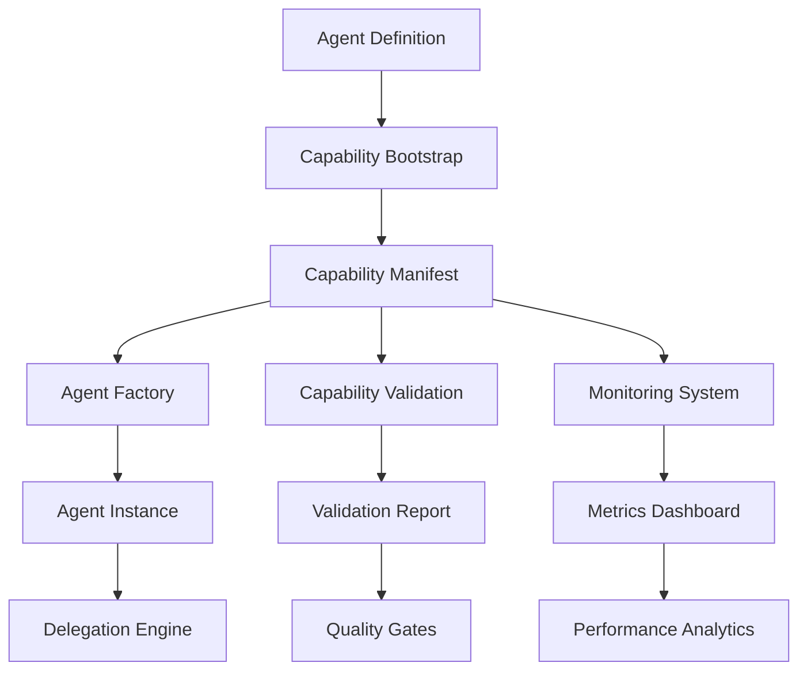

<!-- TLP:CLEAR -->

# DCYFR Capability Bootstrap Integration Guide

**Information Classification:** TLP:CLEAR (Public)  
**Last Updated:** February 15, 2026  
**Version:** 1.0.0  

## Overview

This guide demonstrates how to integrate the DCYFR Capability Bootstrap system with other DCYFR AI components, external systems, and development workflows. The bootstrap system serves as the foundation for automated agent onboarding and capability management.

## Architecture Integration

### Core System Integration Flow



### Integration Points

| Component | Integration Type | Bootstrap Role | Data Flow |
|-----------|-----------------|----------------|-----------|
| **Agent Factory** | Direct | Manifest Provider | Bootstrap → Manifest → Factory |
| **Capability Validation** | Pipeline | Quality Gate | Bootstrap → Validate → Deploy |
| **Monitoring System** | Event-Driven | Metrics Source | Bootstrap → Track → Monitor |
| **Delegation Engine** | Runtime | Capability Discovery | Bootstrap → Delegate → Execute |
| **MCP Servers** | Configuration | Server Registration | Bootstrap → Configure → Connect |

## Integration Patterns

### Pattern 1: Development Workflow Integration

Complete integration with development and deployment workflows.

```typescript
// workflow/agent-development.ts
import { bootstrapAgent } from '@dcyfr/ai/capability-bootstrap';
import { validateCapabilities } from '@dcyfr/ai/capability-validation';
import { AgentFactory } from '@dcyfr/ai';
import { deployAgent } from '@dcyfr/ai/deployment';

export async function developmentWorkflow(agentPath: string) {
  console.log('🚀 Starting agent development workflow...');
  
  // Step 1: Bootstrap agent from definition
  console.log('1. Bootstrapping agent...');
  const bootstrap = await bootstrapAgent({
    type: 'file',
    filePath: agentPath
  });
  
  console.log(`   ✅ Generated manifest for ${bootstrap.agentId}`);
  console.log(`   📊 Detected ${bootstrap.manifest.capabilities.length} capabilities`);
  
  // Step 2: Quality gates - validate capabilities
  console.log('2. Running capability validation...');
  const validation = await validateCapabilities(bootstrap.manifest);
  
  if (validation.overallScore < 0.8) {
    console.error('   ❌ Validation failed - score too low');
    console.log('   📝 Suggestions:', bootstrap.suggestions);
    throw new Error('Agent validation failed');
  }
  
  console.log(`   ✅ Validation passed - score: ${validation.overallScore}`);
  
  // Step 3: Create agent instance
  console.log('3. Creating agent instance...');
  const agent = AgentFactory.create(bootstrap.manifest);
  
  // Step 4: Integration testing
  console.log('4. Running integration tests...');
  const testResults = await runIntegrationTests(agent, bootstrap.manifest);
  
  if (!testResults.passed) {
    console.error('   ❌ Integration tests failed');
    throw new Error('Agent integration tests failed');
  }
  
  console.log('   ✅ Integration tests passed');
  
  // Step 5: Deploy to environment
  console.log('5. Deploying agent...');
  const deployment = await deployAgent(agent, {
    environment: process.env.NODE_ENV || 'development',
    capabilities: bootstrap.manifest.capabilities
  });
  
  console.log(`   ✅ Agent deployed: ${deployment.url}`);
  
  return {
    agent,
    bootstrap,
    validation,
    deployment,
    testResults
  };
}

// Usage in CI/CD pipeline
async function cicdPipeline() {
  try {
    const result = await developmentWorkflow('./agents/new-feature-agent.agent.md');
    console.log('🎉 Agent development workflow completed successfully');
    return result;
  } catch (error) {
    console.error('💥 Workflow failed:', error.message);
    process.exit(1);
  }
}
```

### Pattern 2: Batch Agent Onboarding

Automated batch onboarding for multiple agents with validation and rollback.

```typescript
// onboarding/batch-onboarding.ts
import { bootstrapAgents } from '@dcyfr/ai/capability-bootstrap';
import { validateCapabilities } from '@dcyfr/ai/capability-validation';
import { AgentRegistry } from '@dcyfr/ai/registry';
import { glob } from 'glob';

interface OnboardingConfig {
  sourcePath: string;
  validationThreshold: number;
  rollbackOnFailure: boolean;
  parallelProcessing: boolean;
  maxConcurrency?: number;
}

export async function batchOnboarding(config: OnboardingConfig) {
  console.log('🚀 Starting batch agent onboarding...');
  
  // Step 1: Discover agent files
  const agentFiles = await glob(`${config.sourcePath}/**/*.agent.md`);
  console.log(`📁 Found ${agentFiles.length} agent files`);
  
  // Step 2: Create agent sources
  const sources = agentFiles.map(filePath => ({
    type: 'file' as const,
    filePath
  }));
  
  // Step 3: Batch bootstrap
  console.log('⚡ Bootstrapping agents...');
  const bootstrapResults = await bootstrapAgents(sources);
  
  console.log(`✅ Bootstrapped ${bootstrapResults.length} agents`);
  
  // Step 4: Parallel validation
  console.log('🔍 Validating capabilities...');
  const validationPromises = bootstrapResults.map(async (result) => {
    const validation = await validateCapabilities(result.manifest);
    return {
      agentId: result.agentId,
      bootstrap: result,
      validation,
      passed: validation.overallScore >= config.validationThreshold
    };
  });
  
  const validationResults = await Promise.all(validationPromises);
  
  // Step 5: Analyze results
  const passed = validationResults.filter(r => r.passed);
  const failed = validationResults.filter(r => !r.passed);
  
  console.log(`📊 Validation Results:`);
  console.log(`   ✅ Passed: ${passed.length}`);
  console.log(`   ❌ Failed: ${failed.length}`);
  
  // Step 6: Handle failures
  if (failed.length > 0 && config.rollbackOnFailure) {
    console.error('💥 Validation failures detected - rolling back');
    await rollbackOnboarding(passed.map(r => r.agentId));
    throw new Error(`${failed.length} agents failed validation`);
  }
  
  // Step 7: Register successful agents
  const registry = new AgentRegistry();
  
  for (const result of passed) {
    await registry.register(result.bootstrap.manifest);
    console.log(`📝 Registered: ${result.agentId}`);
  }
  
  console.log('🎉 Batch onboarding completed successfully');
  
  return {
    total: bootstrapResults.length,
    passed: passed.length,
    failed: failed.length,
    agents: passed.map(r => r.agentId),
    failures: failed.map(r => ({
      agentId: r.agentId,
      score: r.validation.overallScore,
      suggestions: r.bootstrap.suggestions
    }))
  };
}

async function rollbackOnboarding(agentIds: string[]) {
  const registry = new AgentRegistry();
  
  for (const agentId of agentIds) {
    try {
      await registry.unregister(agentId);
      console.log(`🔙 Rolled back: ${agentId}`);
    } catch (error) {
      console.warn(`⚠️ Failed to rollback ${agentId}:`, error.message);
    }
  }
}
```

### Pattern 3: Runtime Capability Discovery

Dynamic capability discovery and delegation at runtime.

```typescript
// runtime/dynamic-delegation.ts
import { bootstrapAgent } from '@dcyfr/ai/capability-bootstrap';
import { DelegationEngine } from '@dcyfr/ai/delegation';
import { AgentRegistry } from '@dcyfr/ai/registry';

export class DynamicCapabilityManager {
  private delegationEngine: DelegationEngine;
  private registry: AgentRegistry;
  private bootstrapCache: Map<string, any> = new Map();
  
  constructor() {
    this.delegationEngine = new DelegationEngine();
    this.registry = new AgentRegistry();
  }
  
  /**
   * Dynamically discover and register agent capabilities
   */
  async discoverCapabilities(agentSource: string): Promise<string[]> {
    // Check cache first
    if (this.bootstrapCache.has(agentSource)) {
      const cached = this.bootstrapCache.get(agentSource);
      return cached.manifest.capabilities.map((c: any) => c.id);
    }
    
    // Bootstrap agent to discover capabilities
    const bootstrap = await bootstrapAgent({
      type: 'file',
      filePath: agentSource
    });
    
    // Cache results
    this.bootstrapCache.set(agentSource, bootstrap);
    
    // Register with delegation engine
    await this.delegationEngine.registerCapabilities(
      bootstrap.agentId,
      bootstrap.manifest.capabilities
    );
    
    return bootstrap.manifest.capabilities.map(c => c.id);
  }
  
  /**
   * Find best agent for a specific capability at runtime
   */
  async findCapableAgent(requiredCapability: string): Promise<{
    agentId: string;
    confidence: number;
    manifest: any;
  } | null> {
    // Query delegation engine for capable agents
    const candidates = await this.delegationEngine.findCapableAgents(requiredCapability);
    
    if (candidates.length === 0) {
      // Try to bootstrap any unregistered agents
      await this.bootstrapUnregisteredAgents();
      
      // Retry search
      const retryResults = await this.delegationEngine.findCapableAgents(requiredCapability);
      return retryResults.length > 0 ? retryResults[0] : null;
    }
    
    // Return best match
    return candidates[0];
  }
  
  private async bootstrapUnregisteredAgents(): Promise<void> {
    // Implementation would discover and bootstrap unregistered agents
    // This is a simplified version
    const unregisteredSources = await this.findUnregisteredSources();
    
    for (const source of unregisteredSources) {
      try {
        await this.discoverCapabilities(source);
      } catch (error) {
        console.warn(`Failed to bootstrap ${source}:`, error.message);
      }
    }
  }
  
  private async findUnregisteredSources(): Promise<string[]> {
    // Implementation would scan for new agent files
    return [];
  }
}

// Usage in application
export async function runtimeCapabilityIntegration() {
  const manager = new DynamicCapabilityManager();
  
  // Discover capabilities for available agents
  const webDevCapabilities = await manager.discoverCapabilities('./agents/web-developer.agent.md');
  const apiDevCapabilities = await manager.discoverCapabilities('./agents/api-developer.agent.md');
  
  console.log('Web Dev Capabilities:', webDevCapabilities);
  console.log('API Dev Capabilities:', apiDevCapabilities);
  
  // At runtime, find agent for specific task
  const codeReviewAgent = await manager.findCapableAgent('code_review');
  
  if (codeReviewAgent) {
    console.log(`Selected agent for code review: ${codeReviewAgent.agentId}`);
    console.log(`Confidence level: ${codeReviewAgent.confidence}`);
    
    // Delegate task to selected agent
    // Implementation would use the agent for actual work
  } else {
    console.warn('No agent found with code review capability');
  }
}
```

### Pattern 4: MCP Server Integration

Bootstrap agents and configure MCP server connections automatically.

```typescript
// integration/mcp-integration.ts
import { bootstrapAgent } from '@dcyfr/ai/capability-bootstrap';
import { MCPServerManager } from '@dcyfr/ai/mcp';
import { writeFileSync } from 'fs';

interface MCPIntegrationConfig {
  agentPath: string;
  mcpConfigPath: string;
  serverMappings: Record<string, string[]>; // capability -> mcp servers
}

export async function integrateMCPServers(config: MCPIntegrationConfig) {
  console.log('🔌 Integrating MCP servers with agent capabilities...');
  
  // Step 1: Bootstrap agent to discover capabilities
  const bootstrap = await bootstrapAgent({
    type: 'file',
    filePath: config.agentPath
  });
  
  const capabilities = bootstrap.manifest.capabilities.map(c => c.id);
  console.log(`📊 Agent capabilities: ${capabilities.join(', ')}`);
  
  // Step 2: Map capabilities to required MCP servers
  const requiredServers = new Set<string>();
  
  for (const capability of capabilities) {
    const servers = config.serverMappings[capability] || [];
    servers.forEach(server => requiredServers.add(server));
  }
  
  console.log(`🔌 Required MCP servers: ${Array.from(requiredServers).join(', ')}`);
  
  // Step 3: Generate MCP configuration
  const mcpConfig = {
    mcpServers: {}
  };
  
  for (const serverName of requiredServers) {
    mcpConfig.mcpServers[serverName] = getMCPServerConfig(serverName);
  }
  
  // Step 4: Write MCP configuration file
  writeFileSync(config.mcpConfigPath, JSON.stringify(mcpConfig, null, 2));
  console.log(`📝 Generated MCP config: ${config.mcpConfigPath}`);
  
  // Step 5: Initialize MCP server manager
  const mcpManager = new MCPServerManager();
  await mcpManager.loadConfig(config.mcpConfigPath);
  
  // Step 6: Start required servers
  for (const serverName of requiredServers) {
    try {
      await mcpManager.startServer(serverName);
      console.log(`✅ Started MCP server: ${serverName}`);
    } catch (error) {
      console.error(`❌ Failed to start ${serverName}:`, error.message);
    }
  }
  
  console.log('🎉 MCP integration completed');
  
  return {
    agentId: bootstrap.agentId,
    capabilities,
    mcpServers: Array.from(requiredServers),
    mcpConfig
  };
}

function getMCPServerConfig(serverName: string) {
  // Predefined MCP server configurations
  const serverConfigs = {
    'filesystem': {
      command: 'npx',
      args: ['-y', '@dcyfr/mcp-filesystem@latest']
    },
    'github': {
      command: 'npx',
      args: ['-y', '@dcyfr/mcp-github@latest'],
      env: {
        GITHUB_TOKEN: '${GITHUB_TOKEN}'
      }
    },
    'playwright': {
      command: 'npx',
      args: ['-y', '@dcyfr/mcp-playwright@latest']
    },
    'memory': {
      command: 'npx',
      args: ['-y', '@dcyfr/mcp-memory@latest']
    }
  };
  
  return serverConfigs[serverName] || {
    command: 'npx',
    args: ['-y', `@dcyfr/mcp-${serverName}@latest`]
  };
}

// Example usage with DCYFR workspace integration
export async function workspaceIntegration() {
  await integrateMCPServers({
    agentPath: './agents/fullstack-developer.agent.md',
    mcpConfigPath: './.mcp.json',
    serverMappings: {
      'code_generation': ['filesystem', 'github'],
      'debugging': ['filesystem', 'playwright'],
      'testing': ['filesystem', 'playwright'],
      'documentation': ['filesystem', 'github'],
      'code_review': ['github', 'filesystem'],
      'ui_development': ['playwright', 'filesystem']
    }
  });
}
```

### Pattern 5: Monitoring and Analytics Integration

Integrate bootstrap system with monitoring for capability tracking and optimization.

```typescript
// monitoring/capability-analytics.ts
import { bootstrapAgent } from '@dcyfr/ai/capability-bootstrap';
import { MetricsCollector } from '@dcyfr/ai/monitoring';
import { CapabilityPerformanceTracker } from '@dcyfr/ai/analytics';

export class CapabilityAnalytics {
  private metricsCollector: MetricsCollector;
  private performanceTracker: CapabilityPerformanceTracker;
  
  constructor() {
    this.metricsCollector = new MetricsCollector();
    this.performanceTracker = new CapabilityPerformanceTracker();
  }
  
  /**
   * Bootstrap agent with full analytics integration
   */
  async bootstrapWithAnalytics(agentPath: string) {
    const startTime = Date.now();
    
    // Bootstrap agent
    const bootstrap = await bootstrapAgent({
      type: 'file',
      filePath: agentPath
    });
    
    const bootstrapTime = Date.now() - startTime;
    
    // Track bootstrap metrics
    await this.metricsCollector.record('agent_bootstrap', {
      agentId: bootstrap.agentId,
      capabilities: bootstrap.manifest.capabilities.length,
      overallConfidence: bootstrap.manifest.overall_confidence,
      detectedCapabilities: bootstrap.detectedCapabilities.length,
      warnings: bootstrap.warnings.length,
      suggestions: bootstrap.suggestions.length,
      bootstrapTimeMs: bootstrapTime
    });
    
    // Initialize capability performance tracking
    for (const capability of bootstrap.manifest.capabilities) {
      await this.performanceTracker.initializeCapability(
        bootstrap.agentId,
        capability.id,
        capability.confidence_level
      );
    }
    
    // Track capability distribution
    await this.trackCapabilityDistribution(bootstrap.manifest.capabilities);
    
    console.log(`📊 Analytics initialized for ${bootstrap.agentId}`);
    
    return {
      bootstrap,
      metrics: {
        bootstrapTime,
        capabilityCount: bootstrap.manifest.capabilities.length,
        averageConfidence: bootstrap.manifest.overall_confidence
      }
    };
  }
  
  /**
   * Track capability usage and performance over time
   */
  async trackCapabilityUsage(
    agentId: string,
    capabilityId: string,
    success: boolean,
    executionTime: number,
    metadata?: Record<string, any>
  ) {
    await this.performanceTracker.recordExecution(
      agentId,
      capabilityId,
      success,
      executionTime,
      metadata
    );
    
    // Update capability confidence based on performance
    if (success) {
      await this.performanceTracker.increaseConfidence(agentId, capabilityId);
    } else {
      await this.performanceTracker.decreaseConfidence(agentId, capabilityId);
    }
  }
  
  /**
   * Generate capability analytics report
   */
  async generateAnalyticsReport(agentId: string) {
    const capabilities = await this.performanceTracker.getCapabilities(agentId);
    
    const report = {
      agentId,
      totalCapabilities: capabilities.length,
      activeCapabilities: capabilities.filter(c => c.enabled).length,
      averageConfidence: capabilities.reduce((sum, c) => sum + c.confidence, 0) / capabilities.length,
      highPerformingCapabilities: capabilities.filter(c => c.confidence > 0.9),
      underPerformingCapabilities: capabilities.filter(c => c.confidence < 0.6),
      recentActivity: await this.performanceTracker.getRecentActivity(agentId),
      recommendations: this.generateRecommendations(capabilities)
    };
    
    return report;
  }
  
  private async trackCapabilityDistribution(capabilities: any[]) {
    const distribution = capabilities.reduce((acc, cap) => {
      acc[cap.id] = (acc[cap.id] || 0) + 1;
      return acc;
    }, {});
    
    await this.metricsCollector.record('capability_distribution', distribution);
  }
  
  private generateRecommendations(capabilities: any[]): string[] {
    const recommendations: string[] = [];
    
    const underPerforming = capabilities.filter(c => c.confidence < 0.6);
    if (underPerforming.length > 0) {
      recommendations.push(`Consider additional training for: ${underPerforming.map(c => c.id).join(', ')}`);
    }
    
    const unused = capabilities.filter(c => c.executionCount === 0);
    if (unused.length > 0) {
      recommendations.push(`Unused capabilities detected: ${unused.map(c => c.id).join(', ')}`);
    }
    
    return recommendations;
  }
}

// Usage example
export async function analyticsIntegration() {
  const analytics = new CapabilityAnalytics();
  
  // Bootstrap with analytics
  const result = await analytics.bootstrapWithAnalytics('./agents/data-analyst.agent.md');
  
  console.log('Bootstrap metrics:', result.metrics);
  
  // Simulate capability usage
  await analytics.trackCapabilityUsage(
    result.bootstrap.agentId,
    'data_analysis',
    true,
    1500,
    { dataSize: '10MB', complexity: 'medium' }
  );
  
  // Generate report
  const report = await analytics.generateAnalyticsReport(result.bootstrap.agentId);
  console.log('Analytics report:', report);
}
```

## Testing Integration

### Unit Testing Bootstrap Integration

```typescript
// __tests__/integration/bootstrap-integration.test.ts
import { describe, it, expect, beforeEach, afterEach } from 'vitest';
import { bootstrapAgent } from '@dcyfr/ai/capability-bootstrap';
import { AgentFactory } from '@dcyfr/ai';
import { writeFileSync, unlinkSync } from 'fs';

describe('Bootstrap Integration Tests', () => {
  const testAgentPath = '/tmp/test-agent.agent.md';
  
  beforeEach(() => {
    // Create test agent file
    const agentContent = `---
name: test-integration-agent
description: Test agent for integration testing
tools: ['read', 'write', 'execute']
model: gpt-4
category: testing
---

# Test Integration Agent

This agent is designed for integration testing of the bootstrap system.

## Capabilities

- Code generation and modification
- Test execution and validation  
- Documentation creation
- Performance analysis
`;
    
    writeFileSync(testAgentPath, agentContent);
  });
  
  afterEach(() => {
    if (require('fs').existsSync(testAgentPath)) {
      unlinkSync(testAgentPath);
    }
  });
  
  it('should bootstrap and create agent instance', async () => {
    // Bootstrap agent
    const bootstrap = await bootstrapAgent({
      type: 'file',
      filePath: testAgentPath
    });
    
    expect(bootstrap.agentId).toBe('test-integration-agent');
    expect(bootstrap.manifest.capabilities.length).toBeGreaterThan(0);
    
    // Create agent instance
    const agent = AgentFactory.create(bootstrap.manifest);
    
    expect(agent).toBeDefined();
    expect(agent.getName()).toBe('test-integration-agent');
    expect(agent.getCapabilities().length).toBe(bootstrap.manifest.capabilities.length);
  });
  
  it('should handle bootstrap warnings gracefully', async () => {
    // Create agent with potential warnings
    const warningAgentContent = `---
name: warning-test-agent  
description: Agent with minimal content for warning testing
---

# Minimal Agent

This agent has minimal content.`;
    
    writeFileSync(testAgentPath, warningAgentContent);
    
    const bootstrap = await bootstrapAgent({
      type: 'file',
      filePath: testAgentPath
    });
    
    // Should still succeed despite warnings
    expect(bootstrap.agentId).toBe('warning-test-agent');
    expect(bootstrap.warnings.length).toBeGreaterThan(0);
    expect(bootstrap.suggestions.length).toBeGreaterThan(0);
  });
  
  it('should handle integration with validation', async () => {
    const bootstrap = await bootstrapAgent({
      type: 'file',
      filePath: testAgentPath
    });
    
    // Mock validation integration
    const mockValidation = {
      overallScore: 0.85,
      capabilities: bootstrap.manifest.capabilities.map(c => ({
        id: c.id,
        score: 0.85,
        issues: []
      }))
    };
    
    expect(mockValidation.overallScore).toBeGreaterThan(0.8);
    expect(mockValidation.capabilities.length).toBe(bootstrap.manifest.capabilities.length);
  });
});
```

## Deployment Integration

### Docker Container Integration

```dockerfile
# Dockerfile with bootstrap integration
FROM node:18-alpine

WORKDIR /app

# Copy package files
COPY package*.json ./
RUN npm install

# Copy source code
COPY . .

# Bootstrap agents during container build
RUN npm run bootstrap-agents

# Start application
CMD ["npm", "start"]
```

```typescript
// scripts/bootstrap-agents.ts - Run during Docker build
import { bootstrapAgents } from '@dcyfr/ai/capability-bootstrap';
import { glob } from 'glob';
import { writeFileSync, mkdirSync } from 'fs';

async function dockerBootstrap() {
  console.log('🐳 Docker: Bootstrapping agents...');
  
  // Find all agent files
  const agentFiles = await glob('./agents/**/*.agent.md');
  const sources = agentFiles.map(filePath => ({ type: 'file' as const, filePath }));
  
  // Bootstrap all agents
  const results = await bootstrapAgents(sources);
  
  // Create manifests directory
  mkdirSync('./dist/manifests', { recursive: true });
  
  // Save manifests for runtime
  for (const result of results) {
    writeFileSync(
      `./dist/manifests/${result.agentId}.json`,
      JSON.stringify(result.manifest, null, 2)
    );
  }
  
  console.log(`✅ Bootstrapped ${results.length} agents for Docker deployment`);
}

dockerBootstrap().catch(console.error);
```

## Best Practices for Integration

### 1. Configuration Management

```typescript
// config/bootstrap-config.ts
export const BOOTSTRAP_CONFIG = {
  development: {
    minimumKeywordMatches: 1,
    initialConfidence: 0.40,
    gradualValidation: true
  },
  staging: {
    minimumKeywordMatches: 2,
    initialConfidence: 0.60,
    gradualValidation: true
  },
  production: {
    minimumKeywordMatches: 3,
    initialConfidence: 0.70,
    gradualValidation: false
  }
};
```

### 2. Error Recovery

```typescript
// integration/error-recovery.ts
export async function robustBootstrap(source: AgentSource, retries = 3) {
  for (let attempt = 1; attempt <= retries; attempt++) {
    try {
      return await bootstrapAgent(source);
    } catch (error) {
      console.warn(`Bootstrap attempt ${attempt} failed:`, error.message);
      
      if (attempt === retries) {
        throw new Error(`Bootstrap failed after ${retries} attempts: ${error.message}`);
      }
      
      // Exponential backoff
      await new Promise(resolve => setTimeout(resolve, Math.pow(2, attempt) * 1000));
    }
  }
}
```

### 3. Performance Optimization

```typescript
// optimization/bootstrap-cache.ts
export class BootstrapCache {
  private cache = new Map<string, any>();
  
  async bootstrapWithCache(source: AgentSource): Promise<BootstrapResult> {
    const cacheKey = this.generateCacheKey(source);
    
    if (this.cache.has(cacheKey)) {
      return this.cache.get(cacheKey);
    }
    
    const result = await bootstrapAgent(source);
    this.cache.set(cacheKey, result);
    
    return result;
  }
  
  private generateCacheKey(source: AgentSource): string {
    return JSON.stringify(source);
  }
}
```

---

**Next Steps:**
- Implement specific integration patterns in your project
- Review [Capability Validation API](./capability-validation-api.md)
- Explore [Agent Factory Documentation](./agent-factory-api.md)
- Set up monitoring and analytics integration

**Support:**
- Integration questions: [GitHub Discussions](https://github.com/dcyfr/dcyfr-ai/discussions)
- Bug reports: [GitHub Issues](https://github.com/dcyfr/dcyfr-ai/issues)